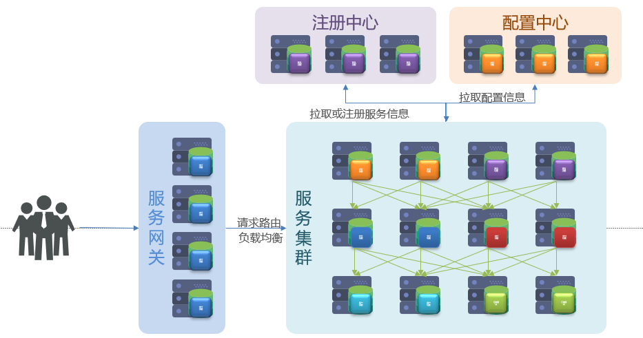
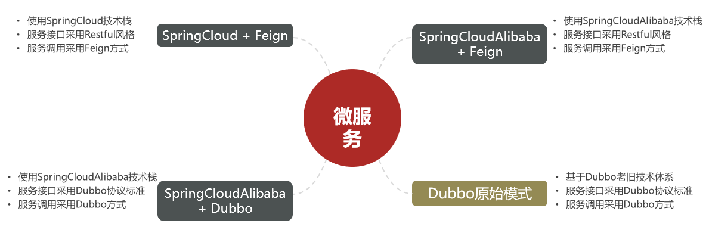
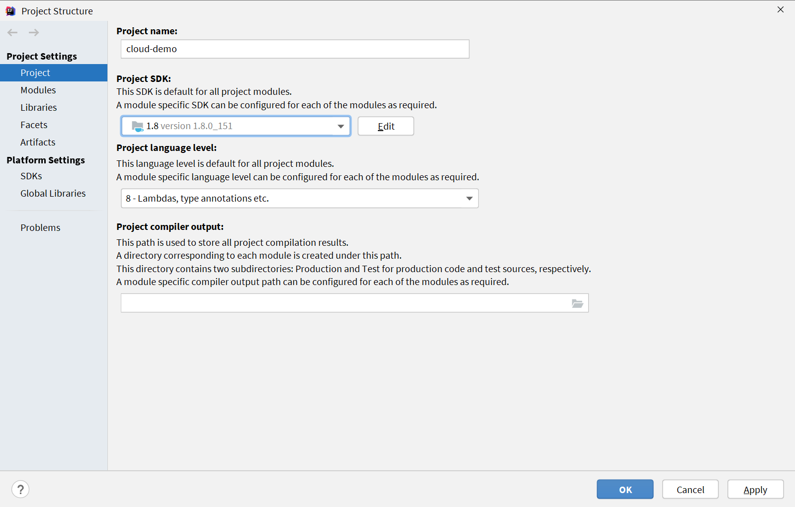
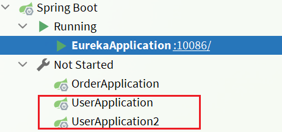
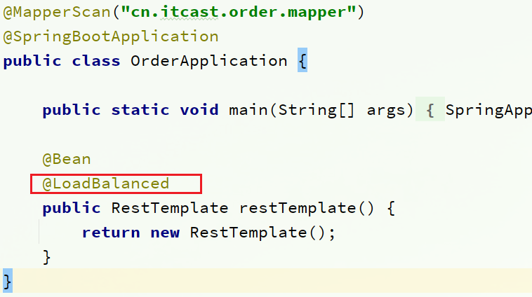
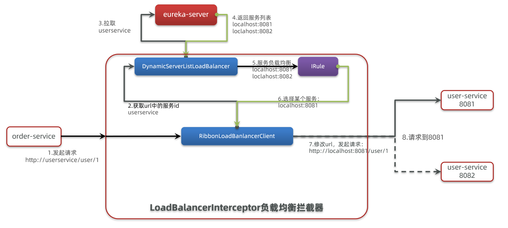
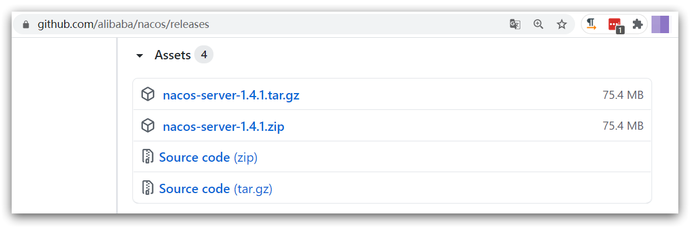
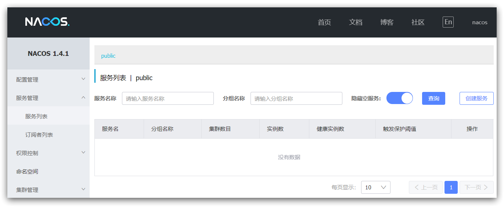

# 一、认识微服务

随着互联网行业的发展，对服务的要求也越来越高，服务架构也从单体架构逐渐演变为现在流行的微服务架构。这些架构之间有怎样的差别呢？

## 1、单体架构

**单体架构**：将业务的所有功能集中在一个项目中开发，打成一个包部署。


单体架构的优缺点如下：

**优点**：

- 架构简单
- 部署成本低

**缺点**：

- 耦合度高（维护困难、升级困难）

## 2、分布式架构

**分布式架构**：根据业务功能对系统做拆分，每个业务功能模块作为独立项目开发，称为一个服务。


分布式架构的优缺点：

**优点**：

- 降低服务耦合
- 有利于服务升级和拓展

**缺点**：

- 服务调用关系错综复杂

分布式架构虽然降低了服务耦合，但是服务拆分时也有很多问题需要思考：

- 服务拆分的粒度如何界定？
- 服务之间如何调用？
- 服务的调用关系如何管理？

人们需要制定一套行之有效的标准来约束分布式架构。

## 3、微服务

微服务的架构特征：

- 单一职责：微服务拆分粒度更小，每一个服务都对应唯一的业务能力，做到单一职责
- 自治：团队独立、技术独立、数据独立，独立部署和交付
- 面向服务：服务提供统一标准的接口，与语言和技术无关
- 隔离性强：服务调用做好隔离、容错、降级，避免出现级联问题


微服务的上述特性其实是在给分布式架构制定一个标准，进一步降低服务之间的耦合度，提供服务的独立性和灵活性。做到高内聚，低耦合。

因此，可以认为**微服务**是一种经过良好架构设计的**分布式架构方案** 。

但方案该怎么落地？选用什么样的技术栈？全球的互联网公司都在积极尝试自己的微服务落地方案。

其中在 Java 领域最引人注目的就是 SpringCloud 提供的方案了。

## 4、微服务技术对比

微服务这种方案需要技术框架来落地，全球的互联网公司都在积极尝试自己的微服务落地技术。在国内最知名的就是 SpringCloud 和阿里巴巴的 Dubbo。



微服务技术对比：

|                |        Dubbo        |       SpringCloud        |    SpringCloudAlibaba    |
| :------------: | :-----------------: | :----------------------: | :----------------------: |
|    注册中心    |  zookeeper、Redis   |      Eureka、Consul      |      Nacos、Eureka       |
|  服务远程调用  |     Dubbo 协议      |    Feign（http 协议）    |       Dubbo、Fegin       |
|    配置中心    |         无          |    SpringCloudConfig     | SpringCloudConfig、Nacos |
|    服务网关    |         无          | SpringCloudGateway、Zuul | SpringCloudGateway、Zuul |
| 服务监视和保护 | dubbo-admin，功能弱 |         Hystrix          |         Sentinel         |

企业需求：



## 5、SpringCloud

SpringCloud 是目前国内使用最广泛的微服务框架。官网地址：https://spring.io/projects/spring-cloud。

SpringCloud 集成了各种微服务功能组件，并基于 SpringBoot 实现了这些组件的自动装配，从而提供了良好的开箱即用体验。

其中常见的组件包括：


另外，SpringCloud 底层是依赖于 SpringBoot 的，并且有版本的兼容关系，如下：


我们学习的版本是 Hoxton.SR10，因此对应的 SpringBoot 版本是 2.3.x 版本。

## 6、总结

- 单体架构：简单方便，高度耦合，扩展性差，适合小型项目。例如：学生管理系统

- 分布式架构：松耦合，扩展性好，但架构复杂，难度大。适合大型互联网项目，例如：京东、淘宝

- 微服务：一种良好的分布式架构方案

  ①优点：拆分粒度更小、服务更独立、耦合度更低

  ②缺点：架构非常复杂，运维、监控、部署难度提高

- SpringCloud 是微服务架构的一站式解决方案，集成了各种优秀微服务功能组件

# 二、服务拆分和远程调用

任何分布式架构都离不开服务的拆分，微服务也是一样。

## 1、服务拆分原则

这里我总结了微服务拆分时的几个原则：

- 不同微服务，不要重复开发相同业务
- 微服务数据独立，不要访问其它微服务的数据库
- 微服务可以将自己的业务暴露为接口，供其它微服务调用


## 2、服务拆分示例

以课前资料中的微服务 cloud-demo 为例，其结构如下：


cloud-demo：父工程，管理依赖

- order-service：订单微服务，负责订单相关业务
- user-service：用户微服务，负责用户相关业务

要求：

- 订单微服务和用户微服务都必须有各自的数据库，相互独立
- 订单服务和用户服务都对外暴露 Restful 的接口
- 订单服务如果需要查询用户信息，只能调用用户服务的 Restful 接口，不能查询用户数据库

### 2.1、导入Sql语句

首先，将课前资料提供的 `cloud-order.sql` 和 `cloud-user.sql` 导入到 mysql 中。

cloud-user 表中初始数据如下：


cloud-order 表中初始数据如下：


cloud-order 表中持有 cloud-user 表中的 id 字段。

### 2.2、导入 demo 工程

用 IDEA 导入课前资料提供的项目工程 cloud-demo：

项目结构如下：


导入后，会在 IDEA 右下角出现弹窗：


点击弹窗，然后按下图选择：


会出现这样的菜单：


配置下项目使用的 JDK：



## 3、实现远程调用案例

在 order-service 服务中，有一个根据 id 查询订单的接口：


根据 id 查询订单，返回值是 Order 对象，如图：


其中的 user 为 null

在 user-service 中有一个根据 id 查询用户的接口：


查询的结果如图：


### 3.1、案例需求

修改 order-service 中的根据 id 查询订单业务，要求在查询订单的同时，根据订单中包含的 userId 查询出用户信息，一起返回。


因此，我们需要在 order-service 中向 user-service 发起一个 http 的请求，调用 http://localhost:8081/user/{userId}这个接口。

大概的步骤是这样的：

- 注册一个 RestTemplate 的实例到 Spring 容器
- 修改 order-service 服务中的 OrderService 类中的 queryOrderById 方法，根据 Order 对象中的 userId 查询 User
- 将查询的 User 填充到 Order 对象，一起返回

### 3.2、注册RestTemplate

首先，我们在 order-service 服务中的 OrderApplication 启动类中，注册 RestTemplate 实例：

```java
package cn.itcast.order;

import org.mybatis.spring.annotation.MapperScan;
import org.springframework.boot.SpringApplication;
import org.springframework.boot.autoconfigure.SpringBootApplication;
import org.springframework.context.annotation.Bean;
import org.springframework.web.client.RestTemplate;

@MapperScan("cn.itcast.order.mapper")
@SpringBootApplication
public class OrderApplication {
    public static void main(String[] args) {
        SpringApplication.run(OrderApplication.class, args);
    }

    @Bean
    public RestTemplate restTemplate() {
        return new RestTemplate();
    }
}
```

### 3.3、实现远程调用

修改 order-service 服务中的 cn.itcast.order.service 包下的 OrderService 类中的 queryOrderById 方法：

```java
@Service
public class OrderService {

    @Autowired
    private OrderMapper orderMapper;
    @Autowired
    private RestTemplate restTemplate;

    public Order queryOrderById(Long orderId) {
        // 1.查询订单
        Order order = orderMapper.findById(orderId);
        // 2.利用RestTemplate发起http请求，查询用户
        // 2.1.url路径
        String url = "http://localhost:8081/user/" + order.getUserId();
        // 2.2.发送http请求，实现远程调用
        User user = restTemplate.getForObject(url, User.class);
        // 3.封装user到Order
        order.setUser(user);
        // 4.返回
        return order;
    }
}
```


## 4、提供者与消费者

在服务调用关系中，会有两个不同的角色：

**服务提供者**：一次业务中，被其它微服务调用的服务。（提供接口给其它微服务）

**服务消费者**：一次业务中，调用其它微服务的服务。（调用其它微服务提供的接口）


但是，服务提供者与服务消费者的角色并不是绝对的，而是相对于业务而言。

如果服务 A 调用了服务 B，而服务 B 又调用了服务 C，服务 B 的角色是什么？

- 对于 A 调用 B 的业务而言：A 是服务消费者，B 是服务提供者
- 对于 B 调用 C 的业务而言：B 是服务消费者，C 是服务提供者

因此，服务 B 既可以是服务提供者，也可以是服务消费者。

# 三、Eureka注册中心

假如我们的服务提供者 user-service 部署了多个实例，如图：


大家思考几个问题：

- order-service 在发起远程调用的时候，该如何得知 user-service 实例的 IP 地址和端口？
- 有多个 user-service 实例地址，order-service 调用时该如何选择？
- order-service 如何得知某个 user-service 实例是否依然健康，是不是已经宕机？

## 1、Eureka的结构和作用

这些问题都需要利用 SpringCloud 中的注册中心来解决，其中最广为人知的注册中心就是 Eureka，其结构如下：


回答之前的各个问题。

问题 1：order-service 如何得知 user-service 实例地址？

获取地址信息的流程如下：

- user-service 服务实例启动后，将自己的信息注册到 eureka-server（Eureka 服务端）。这个叫服务注册
- eureka-server 保存服务名称到服务实例地址列表的映射关系
- order-service 根据服务名称，拉取实例地址列表。这个叫服务发现或服务拉取


问题 2：order-service 如何从多个 user-service 实例中选择具体的实例？

- order-service 从实例列表中利用负载均衡算法选中一个实例地址
- 向该实例地址发起远程调用


问题 3：order-service 如何得知某个 user-service 实例是否依然健康，是不是已经宕机？

- user-service 会每隔一段时间（默认 30 秒）向 eureka-server 发起请求，报告自己状态，称为心跳
- 当超过一定时间没有发送心跳时，eureka-server 会认为微服务实例故障，将该实例从服务列表中剔除
- order-service 拉取服务时，就能将故障实例排除了

> 注意：一个微服务，既可以是服务提供者，又可以是服务消费者，因此 eureka 将服务注册、服务发现等功能统一封装到了 eureka-client 端

因此，接下来我们动手实践的步骤包括：


> 总结：在 Eureka 架构中，微服务角色有两类：
>
> * EurekaServer：服务端，注册中心
>   * 记录服务信息
>   * 心跳监控
> * EurekaClient：客户端
>   * Provider：服务提供者，例如案例中的 user-service
>     * 注册自己的信息到 EurekaServer
>     * 每隔 30 秒向 EurekaServer 发送心跳
>   * consumer：服务消费者，例如案例中的 order-service
>     * 根据服务名称从 EurekaServer 拉取服务列表
>     * 基于服务列表做负载均衡，选中一个微服务后发起远程调用

## 2、搭建eureka-server

首先注册中心服务端：eureka-server，这必须是一个独立的微服务

### 2.1、创建 eureka-server 服务

在 cloud-demo 父工程下，创建一个子模块：


填写模块信息：


然后填写服务信息：


### 2.2、引入 eureka 依赖

引入 SpringCloud 为 eureka 提供的 starter 依赖：

```xml
<dependency>
    <groupId>org.springframework.cloud</groupId>
    <artifactId>spring-cloud-starter-netflix-eureka-server</artifactId>
</dependency>
```

### 2.3、编写启动类

给 eureka-server 服务编写一个启动类，一定要添加一个 @EnableEurekaServer 注解，开启 eureka 的注册中心功能：

```java
package cn.itcast.eureka;

import org.springframework.boot.SpringApplication;
import org.springframework.boot.autoconfigure.SpringBootApplication;
import org.springframework.cloud.netflix.eureka.server.EnableEurekaServer;

@SpringBootApplication
@EnableEurekaServer
public class EurekaApplication {
    public static void main(String[] args) {
        SpringApplication.run(EurekaApplication.class, args);
    }
}
```

### 2.4、编写配置文件

编写一个 application.yml 文件，内容如下：

```yaml
server:
  port: 10086
spring:
  application:
    name: eureka-server
eureka:
  client:
    service-url: 
      defaultZone: http://127.0.0.1:10086/eureka
```

### 2.5、启动服务

启动微服务，然后在浏览器访问：http://127.0.0.1:10086

看到下面结果应该是成功了：


## 3、服务注册

下面，我们将 user-service 注册到 eureka-server 中去。

### 3.1、引入依赖

在 user-service 的 pom 文件中，引入下面的 eureka-client 依赖：

```xml
<dependency>
    <groupId>org.springframework.cloud</groupId>
    <artifactId>spring-cloud-starter-netflix-eureka-client</artifactId>
</dependency>
```

### 3.2、配置文件

在 user-service 中，修改 application.yml 文件，添加服务名称、eureka 地址：

```yaml
spring:
  application:
    name: userservice
eureka:
  client:
    service-url:
      defaultZone: http://127.0.0.1:10086/eureka
```

### 3.3、启动多个user-service实例

为了演示一个服务有多个实例的场景，我们添加一个 SpringBoot 的启动配置，再启动一个 user-service。

首先，复制原来的 user-service 启动配置：


然后，在弹出的窗口中，填写信息（为了避免端口冲突，需要修改端口设置）：


现在，SpringBoot 窗口会出现两个 user-service 启动配置：



不过，第一个是 8081 端口，第二个是 8082 端口。

启动两个 user-service 实例：


查看 eureka-server 管理页面：


## 4、服务发现

下面，我们将 order-service 的逻辑修改：向 eureka-server 拉取 user-service 的信息，实现服务发现。

### 4.1、引入依赖

之前说过，服务发现、服务注册统一都封装在 eureka-client 依赖，因此这一步与服务注册时一致。

在 order-service 的 pom 文件中，引入下面的 eureka-client 依赖：

```xml
<dependency>
    <groupId>org.springframework.cloud</groupId>
    <artifactId>spring-cloud-starter-netflix-eureka-client</artifactId>
</dependency>
```

### 4.2、配置文件

服务发现也需要知道 eureka 地址，因此第二步与服务注册一致，都是配置 eureka 信息：

在 order-service 中，修改 application.yml 文件，添加服务名称、eureka 地址：

```yaml
spring:
  application:
    name: orderservice
eureka:
  client:
    service-url:
      defaultZone: http://127.0.0.1:10086/eureka
```

### 4.3、服务拉取和负载均衡

最后，我们要去 eureka-server 中拉取 user-service 服务的实例列表，并且实现负载均衡。

不过这些动作不用我们去做，只需要添加一些注解即可。

在 order-service 的 OrderApplication 中，给 RestTemplate 这个 Bean 添加一个 @LoadBalanced 注解：




修改 order-service 服务中的 cn.itcast.order.service 包下的 OrderService 类中的 queryOrderById 方法。修改访问的 url 路径，用服务名代替 IP、端口：


spring 会自动帮助我们从 eureka-server 端，根据 userservice 这个服务名称，获取实例列表，而后完成负载均衡。

## 5、总结

1. 搭建 EurekaServer
   * 引入 eureka-server 依赖
   * 添加 @EnableEurekaServer 注解
   * 在 application.yml 中配置 eureka 地址

2. 服务注册
   * 引入 eureka-client 依赖
   * 在 application.yml 中配置 eureka 地址

3. 服务发现
   * 引入 eureka-client 依赖
   * 在 application.yml 中配置 eureka 地址
   * 给 RestTemplate 添加 @LoadBalanced 注解
   * 用服务提供者的服务名称远程调用

# 四、Ribbon负载均衡

上一节中，我们添加了 @LoadBalanced 注解，即可实现负载均衡功能，这是什么原理呢？

## 1、负载均衡原理

SpringCloud 底层其实是利用了一个名为 Ribbon 的组件，来实现负载均衡功能的。

负载均衡流程：


那么我们发出的请求明明是 http://userservice/user/1，怎么变成了 http://localhost:8081 的呢？

## 2、源码跟踪

为什么我们只输入了 service 名称就可以访问了呢？之前还要获取 ip 和端口。

显然有人帮我们根据 service 名称，获取到了服务实例的 ip 和端口。它就是 `LoadBalancerInterceptor`，这个类会对 RestTemplate 的请求进行拦截，然后从 Eureka 根据服务 id 获取服务列表，随后利用负载均衡算法得到真实的服务地址信息，替换服务 id。

我们进行源码跟踪：

### 2.1、LoadBalancerIntercepor


可以看到这里的 intercept 方法，拦截了用户的 HttpRequest 请求，然后做了几件事：

- `request.getURI()`：获取请求 URI，本例中就是 http://user-service/user/8
- `originalUri.getHost()`：获取 URI 路径的主机名，其实就是服务 id，即`user-service`
- `this.loadBalancer.execute()`：处理服务 id，和用户请求。

这里的 `this.loadBalancer` 是 `LoadBalancerClient` 类型，我们继续跟入。

### 2.2、LoadBalancerClient

继续跟入 execute 方法：


代码是这样的：

- `getLoadBalancer(serviceId)`：根据服务 id 获取 ILoadBalancer，而 ILoadBalancer 会拿着服务 id 去 eureka 中获取服务列表并保存起来。
- `getServer(loadBalancer)`：利用内置的负载均衡算法，从服务列表中选择一个。本例中，可以看到获取了 8082 端口的服务

放行后，再次访问并跟踪，发现获取的是 8081：

 

果然实现了负载均衡。

### 2.3、负载均衡策略 IRule

在刚才的代码中，可以看到获取服务是通过一个 `getServer` 方法来做负载均衡：

 

我们继续跟入：


继续跟踪源码 chooseServer 方法，发现这么一段代码：

 

我们看看这个 rule 是谁：

 

这里的 rule 默认值是一个 `RoundRobinRule`，看类的介绍：

 

这不就是轮询的意思嘛。

到这里，整个负载均衡的流程我们就清楚了。

### 2.4、总结

SpringCloudRibbon 的底层采用了一个拦截器，拦截了 RestTemplate 发出的请求，对地址做了修改。用一幅图来总结一下：



基本流程如下：

- 拦截 RestTemplate 请求 http://userservice/user/1
- RibbonLoadBalancerClient 会从请求 url 中获取服务名称，也就是 user-service
- DynamicServerListLoadBalancer 根据 user-service 到 eureka 拉取服务列表
- eureka 返回列表，localhost:8081、localhost:8082
- IRule 利用内置负载均衡规则，从列表中选择一个，例如 localhost:8081
- RibbonLoadBalancerClient 修改请求地址，用 localhost:8081 替代 userservice，得到 http://localhost:8081/user/1，发起真实请求

## 3、负载均衡策略

### 3.1、负载均衡策略

负载均衡的规则都定义在 IRule 接口中，而 IRule 有很多不同的实现类：


不同规则的含义如下：

| **内置负载均衡规则类**    | **规则描述**                                                 |
| ------------------------- | ------------------------------------------------------------ |
| RoundRobinRule            | 简单轮询服务列表来选择服务器。它是 Ribbon 默认的负载均衡规则。 |
| AvailabilityFilteringRule | 对以下两种服务器进行忽略：<br/>（1）在默认情况下，这台服务器如果 3 次连接失败，这台服务器就会被设置为“短路”状态。短路状态将持续 30 秒，如果再次连接失败，短路的持续时间就会几何级地增加。<br/>（2）并发数过高的服务器。如果一个服务器的并发连接数过高，配置了 AvailabilityFilteringRule 规则的客户端也会将其忽略。并发连接数的上限，可以由客户端的 \<clientName>.\<clientConfigNameSpace>.ActiveConnectionsLimit 属性进行配置。 |
| WeightedResponseTimeRule  | 为每一个服务器赋予一个权重值。服务器响应时间越长，这个服务器的权重就越小。这个规则会随机选择服务器，这个权重值会影响服务器的选择。 |
| **ZoneAvoidanceRule**     | 以区域可用的服务器为基础进行服务器的选择。使用 Zone 对服务器进行分类，这个 Zone 可以理解为一个机房、一个机架等。而后再对 Zone 内的多个服务做轮询。 |
| BestAvailableRule         | 忽略那些短路的服务器，并选择并发数较低的服务器。             |
| RandomRule                | 随机选择一个可用的服务器。                                   |
| RetryRule                 | 重试机制的选择逻辑                                           |

默认的实现就是 ZoneAvoidanceRule，是一种轮询方案

### 3.2、自定义负载均衡策略

通过定义 IRule 实现可以修改负载均衡规则，有两种方式：

1. 代码方式：在 order-service 中的 OrderApplication 类中，定义一个新的 IRule：
   * 作用范围为全体，即 orderservice 访问任何微服务都会按修改后的规则

```java
@Bean
public IRule randomRule(){
    return new RandomRule();
}
```

2. 配置文件方式：在 order-service 的 application.yml 文件中，添加新的配置也可以修改规则：
   * 只针对某个服务而言

```yaml
userservice: # 给某个微服务配置负载均衡规则，这里是userservice服务
  ribbon:
    NFLoadBalancerRuleClassName: com.netflix.loadbalancer.RandomRule # 负载均衡规则 
```

> **注意**，一般用默认的负载均衡规则，不做修改。

## 4、饥饿加载

Ribbon 默认是采用懒加载，即第一次访问时才会去创建 LoadBalanceClient，请求时间会很长。

而饥饿加载则会在项目启动时创建，降低第一次访问的耗时，在 order-service 的 application.yml 文件通过下面配置开启饥饿加载：

```yaml
ribbon:
  eager-load:
    enabled: true # 开启饥饿加载
    clients: userservice # 指定饥饿加载的服务名称
```

## 5、总结

1. Ribbon负载均衡规则
   * 规则接口是 IRule
   * 默认实现是 ZoneAvoidanceRule，根据 zone 选择服务列表，然后轮询

2. 负载均衡自定义方式
   * 代码方式：配置灵活，但修改时需要重新打包发布
   * 配置方式：直观，方便，无需重新打包发布，但是无法做全局配置

3. 饥饿加载
   * 开启饥饿加载
   * 指定饥饿加载的微服务名称

# 五、Nacos注册中心

国内公司一般都推崇阿里巴巴的技术，比如注册中心，SpringCloudAlibaba 也推出了一个名为 Nacos 的注册中心。

## 1、认识和安装Nacos

[Nacos](https://nacos.io/) 是阿里巴巴的产品，现在是 [SpringCloud](https://spring.io/projects/spring-cloud) 中的一个组件。相比 [Eureka](https://github.com/Netflix/eureka) 功能更加丰富，在国内受欢迎程度较高。


### 1.1、Windows安装

开发阶段采用单机安装即可。

#### 下载安装包

在 Nacos 的 GitHub 页面，提供有下载链接，可以下载编译好的 Nacos 服务端或者源代码：

GitHub主页：https://github.com/alibaba/nacos

GitHub 的 Release 下载页：https://github.com/alibaba/nacos/releases

如图：



#### 解压

将这个包解压到任意非中文目录下，如图：


目录说明：

- bin：启动脚本
- conf：配置文件

#### 端口配置

Nacos 的默认端口是 8848，如果你电脑上的其它进程占用了 8848 端口，请先尝试关闭该进程。

如果无法关闭占用 8848 端口的进程，也可以进入 nacos 的 conf 目录，修改配置文件中的端口：


修改其中的内容：


#### 启动

启动非常简单，进入 bin 目录，结构如下：


然后执行命令即可：

- windows 命令：

  ```
  startup.cmd -m standalone
  ```


执行后的效果如图：


#### 访问

在浏览器输入地址：http://127.0.0.1:8848/nacos 即可：


默认的账号和密码都是 nacos，进入后：



### 1.2、Linux安装

Linux 或者 Mac 安装方式与 Windows 类似。

#### 安装JDK

Nacos 依赖于 JDK 运行，所以 Linux 上也需要安装 JDK 才行。

上传 jdk 安装包到某个目录，例如：`/usr/local/`

然后解压缩：

```sh
tar -xvf jdk-8u144-linux-x64.tar.gz
```

然后重命名为 java

配置环境变量：

```sh
export JAVA_HOME=/usr/local/java
export PATH=$PATH:$JAVA_HOME/bin
```

设置环境变量：

```sh
source /etc/profile
```

#### 上传安装包

如图：


将 tar.gz 上传到 Linux 服务器的某个目录，例如 `/usr/local/src` 目录下：


#### 解压

命令解压缩安装包：

```sh
tar -xvf nacos-server-1.4.1.tar.gz
```

然后删除安装包：

```sh
rm -rf nacos-server-1.4.1.tar.gz
```

目录中最终样式：


目录内部：


#### 端口配置

与 windows 中类似

#### 启动

在 nacos/bin 目录中，输入命令启动 Nacos：

```sh
sh startup.sh -m standalone
```

### 1.3、Nacos的依赖

父工程：

```xml
<!--Nacos的管理依赖-->
<dependency>
    <groupId>com.alibaba.cloud</groupId>
    <artifactId>spring-cloud-alibaba-dependencies</artifactId>
    <version>2.2.5.RELEASE</version>
    <type>pom</type>
    <scope>import</scope>
</dependency>
```

客户端：

```xml
<!-- nacos客户端依赖包 -->
<dependency>
    <groupId>com.alibaba.cloud</groupId>
    <artifactId>spring-cloud-starter-alibaba-nacos-discovery</artifactId>
</dependency>
```

## 2、服务注册到nacos

Nacos 是 SpringCloudAlibaba 的组件，而 SpringCloudAlibaba 也遵循 SpringCloud 中定义的服务注册、服务发现规范。因此使用 Nacos 和使用 Eureka 对于微服务来说，并没有太大区别。

主要差异在于：

- 依赖不同
- 服务地址不同

### 2.1、引入依赖

在 cloud-demo 父工程的 pom 文件中的 `<dependencyManagement>` 中引入 SpringCloudAlibaba 的依赖：

```xml
<!--Nacos的管理依赖-->
<dependency>
    <groupId>com.alibaba.cloud</groupId>
    <artifactId>spring-cloud-alibaba-dependencies</artifactId>
    <version>2.2.6.RELEASE</version>
    <type>pom</type>
    <scope>import</scope>
</dependency>
```

然后在 user-service 和 order-service 中的 pom 文件中引入 nacos-discovery 依赖：

```xml
<!-- nacos客户端依赖包 -->
<dependency>
    <groupId>com.alibaba.cloud</groupId>
    <artifactId>spring-cloud-starter-alibaba-nacos-discovery</artifactId>
</dependency>
```

> **注意**：不要忘了注释掉 eureka 的依赖。

### 2.2、配置 nacos 地址

在 user-service 和 order-service 的 application.yml 中添加 nacos 地址：

```yaml
spring:
  cloud:
    nacos:
      server-addr: localhost:8848
```

> **注意**：不要忘了注释掉 eureka 的地址

### 2.3、重启

重启微服务后，登录 nacos 管理页面，可以看到微服务信息：


## 3、服务分级存储模型

一个**服务**可以有多个**实例**，例如我们的 user-service，可以有:

- 127.0.0.1:8081
- 127.0.0.1:8082
- 127.0.0.1:8083

假如这些实例分布于全国各地的不同机房，例如：

- 127.0.0.1:8081，在上海机房
- 127.0.0.1:8082，在上海机房
- 127.0.0.1:8083，在杭州机房

Nacos 就将同一机房内的实例划分为一个**集群**。

也就是说，user-service 是服务，一个服务可以包含多个集群，如杭州、上海，每个集群下可以有多个实例，形成分级模型，如图：


微服务互相访问时，应该尽可能访问同集群实例，因为本地访问速度更快。当本集群内不可用时，才访问其它集群。例如：


杭州机房内的 order-service 应该优先访问同机房的 user-service。

### 3.1、给user-service配置集群

修改 user-service 的 application.yml 文件，添加集群配置：

```yaml
spring:
  cloud:
    nacos:
      server-addr: localhost:8848
      discovery:
        cluster-name: HZ # 配置集群名称，也就是机房位置，例如：HZ杭州
```

重启两个 user-service 实例后，我们可以在 nacos 控制台看到下面结果：


我们再次复制一个 user-service 启动配置，添加属性：

```sh
-Dserver.port=8083 -Dspring.cloud.nacos.discovery.cluster-name=SH
```

配置如图所示：


启动 UserApplication3 后再次查看 nacos 控制台：


> 总结：
>
> 1. Nacos服务分级存储模型
>    * 一级是服务，例如 userservice
>    * 二级是集群，例如杭州或上海
>    * 三级是实例，例如杭州机房的某台部署了 userservice 的服务器
>
> 2. 如何设置实例的集群属性
>    * 修改 application.yml 文件，添加 spring.cloud.nacos.discovery.cluster-name 属性即可

### 3.2、同集群优先的负载均衡

默认的 `ZoneAvoidanceRule` 并不能实现根据同集群优先来实现负载均衡。

因此 Nacos 中提供了一个 `NacosRule` 的实现，可以优先从同集群中挑选实例。

1. 给 order-service 配置集群信息

修改 order-service 的 application.yml 文件，添加集群配置：

```sh
spring:
  cloud:
    nacos:
      server-addr: localhost:8848
      discovery:
        cluster-name: HZ # 集群名称
```

2. 修改负载均衡规则

修改 order-service 的 application.yml 文件，修改负载均衡规则：

```yaml
userservice:
  ribbon:
    NFLoadBalancerRuleClassName: com.alibaba.cloud.nacos.ribbon.NacosRule # 负载均衡规则 
```

> 总结：NacosRule 负载均衡策略
>
> * 优先选择同集群服务实例列表
>
> * 本地集群找不到提供者，才去其它集群寻找，并且会报警告
>
> * 确定了可用实例列表后，再采用随机负载均衡挑选实例

## 4、权重配置

实际部署中会出现这样的场景：

服务器设备性能有差异，部分实例所在机器性能较好，另一些较差，我们希望性能好的机器承担更多的用户请求。

但默认情况下 NacosRule 是同集群内随机挑选，不会考虑机器的性能问题。

因此，Nacos 提供了权重配置来控制访问频率，权重越大则访问频率越高。

在 nacos 控制台，找到 user-service 的实例列表，点击编辑，即可修改权重：


在弹出的编辑窗口，修改权重，将权重设置为 0.1，测试可以发现 8081 被访问到的频率大大降低


> **注意**：
>
> * Nacos控制台可以设置实例的权重值，0~1之间
>
> * 同集群内的多个实例，权重越高被访问的频率越高
>
> * 如果权重修改为0，则该实例永远不会被访问

## 5、环境隔离

Nacos 提供了 namespace 来实现环境隔离功能，比如基于开发测试生产环境不同做隔离。

- nacos 中可以有多个 namespace
- namespace 下可以有 group、service 等
- 不同 namespace 之间相互隔离，例如不同 namespace 的服务互相不可见


### 5.1、创建 namespace

默认情况下，所有 service、data、group 都在同一个 namespace，名为 public：


我们可以点击页面新增按钮，添加一个namespace：


然后，填写表单：


就能在页面看到一个新的 namespace：


### 5.2、给微服务配置 namespace

给微服务配置 namespace 只能通过修改配置来实现。

例如，修改 order-service 的 application.yml 文件：

```yaml
spring:
  cloud:
    nacos:
      server-addr: localhost:8848
      discovery:
        cluster-name: HZ
        namespace: 492a7d5d-237b-46a1-a99a-fa8e98e4b0f9 # 命名空间，填ID
```

重启 order-service 后，访问控制台，可以看到下面的结果：


此时访问 order-service，因为 namespace 不同，会导致找不到 userservice，控制台会报错：


>  总结：
>
> * 每个 namespace 都有唯一 id
> * 服务设置 namespace 时要写 id 而不是名称
> * 不同 namespace 下的服务互相不可见

## 6、Nacos与Eureka的区别

Nacos 的服务实例分为两种类型：

- 临时实例：如果实例宕机超过一定时间，会从服务列表剔除，默认的类型。

- 非临时实例：如果实例宕机，不会从服务列表剔除，也可以叫永久实例。

配置一个服务实例为永久实例：

```yaml
spring:
  cloud:
    nacos:
      discovery:
        ephemeral: false # 设置为非临时实例
```

Nacos 和 Eureka 整体结构类似，服务注册、服务拉取、心跳等待，但是也存在一些差异：


- Nacos 与 eureka 的共同点
  - 都支持服务注册和服务拉取
  - 都支持服务提供者心跳方式做健康检测

- Nacos 与 Eureka 的区别
  - Nacos 支持服务端主动检测提供者状态：临时实例采用心跳模式，非临时实例采用主动检测模式
  - 临时实例心跳不正常会被剔除，非临时实例则不会被剔除
  - Nacos 支持服务列表变更的消息推送模式，服务列表更新更及时
  - Nacos 集群默认采用 AP 方式，当集群中存在非临时实例时，采用 CP 模式；Eureka 采用 AP 方式


