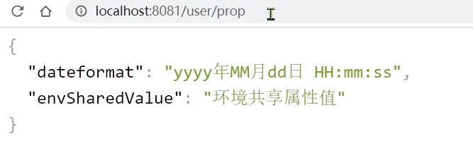
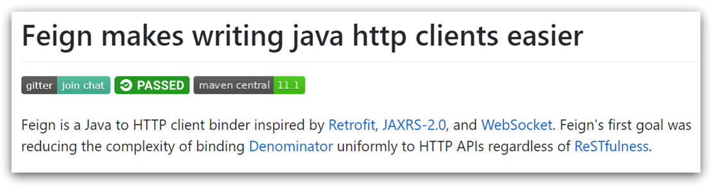
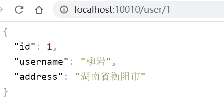

# 一、Nacos 配置管理

Nacos 除了可以做注册中心，同样可以做配置管理来使用。

## 1、统一配置管理

当微服务部署的实例越来越多，达到数十、数百时，逐个修改微服务配置就会让人抓狂，而且很容易出错。我们需要一种统一配置管理方案，可以集中管理所有实例的配置。


Nacos 一方面可以将配置集中管理，另一方可以在配置变更时，及时通知微服务，实现配置的热更新。

### 1.1、在nacos中添加配置文件

如何在 nacos 中管理配置呢？

在 Nacos 中添加配置信息：


然后在弹出的表单中，填写配置信息：


> 注意：项目的核心配置，需要热更新的配置才有放到 nacos 管理的必要。基本不会变更的一些配置还是保存在微服务本地比较好。

### 1.2、从微服务拉取配置

微服务要拉取 nacos 中管理的配置，并且与本地的 application.yml 配置合并，才能完成项目启动。

但如果尚未读取 application.yml，又如何得知 nacos 地址呢？

因此 Spring 引入了一种新的配置文件：bootstrap.yaml 文件，会在 application.yml 之前被读取，流程如下：


1）引入 nacos-config 依赖

首先，在 user-service 服务中，引入 nacos-config 的配置管理客户端依赖：

```xml
<!--nacos配置管理依赖-->
<dependency>
    <groupId>com.alibaba.cloud</groupId>
    <artifactId>spring-cloud-starter-alibaba-nacos-config</artifactId>
</dependency>
```

2）添加 bootstrap.yaml

然后，在 user-service 的 resource 目录添加一个 bootstrap.yaml 文件，这个文件是引导文件，优先级高于application.yml，内容如下：

```yaml
spring:
  application:
    name: userservice # 服务名称
  profiles:
    active: dev #开发环境，这里是dev 
  cloud:
    nacos:
      server-addr: localhost:8848 # Nacos地址
      config:
        file-extension: yaml # 文件后缀名
```

这里会根据 spring.cloud.nacos.server-addr 获取 nacos 地址，再根据 

`${spring.application.name}-${spring.profiles.active}.${spring.cloud.nacos.config.file-extension}`  作为文件 id，来读取配置。

本例中，就是去读取 `userservice-dev.yaml`：


3）读取 nacos 配置

在 user-service 中的 UserController 中添加业务逻辑，读取 pattern.dateformat 配置：


完整代码：

```java
package cn.itcast.user.web;

import cn.itcast.user.pojo.User;
import cn.itcast.user.service.UserService;
import lombok.extern.slf4j.Slf4j;
import org.springframework.beans.factory.annotation.Autowired;
import org.springframework.beans.factory.annotation.Value;
import org.springframework.web.bind.annotation.*;

import java.time.LocalDateTime;
import java.time.format.DateTimeFormatter;

@Slf4j
@RestController
@RequestMapping("/user")
public class UserController {

    @Autowired
    private UserService userService;

    @Value("${pattern.dateformat}")
    private String dateformat;
    
    @GetMapping("now")
    public String now(){
        return LocalDateTime.now().format(DateTimeFormatter.ofPattern(dateformat));
    }
    
    // ...略
}
```

在页面访问，可以看到效果：


> 总结：将配置交给 Nacos 管理的步骤
>
> 1. 在 Nacos 中添加配置文件
>
> 2. 在微服务中引入 nacos 的 config 依赖
>
> 3. 在微服务中添加 bootstrap.yml，配置 nacos 地址、当前环境、服务名称、文件后缀名。这些决定了程序启动时去 nacos 读取哪个文件

## 2、配置热更新

我们最终的目的，是修改 nacos 中的配置后，微服务中无需重启即可让配置生效，也就是**配置热更新**。

要实现配置热更新，可以使用两种方式：

### 2.1、方式一

在 @Value 注入的变量所在类上添加注解 @RefreshScope：


### 2.2、方式二

使用 @ConfigurationProperties 注解代替 @Value 注解。

在 user-service 服务中，添加一个类，读取 patterrn.dateformat 属性：

```java
package cn.itcast.user.config;

import lombok.Data;
import org.springframework.boot.context.properties.ConfigurationProperties;
import org.springframework.stereotype.Component;

@Component
@Data
@ConfigurationProperties(prefix = "pattern")
public class PatternProperties {
    private String dateformat;
}
```

在 UserController 中使用这个类代替 @Value：


完整代码：

```java
package cn.itcast.user.web;

import cn.itcast.user.config.PatternProperties;
import cn.itcast.user.pojo.User;
import cn.itcast.user.service.UserService;
import lombok.extern.slf4j.Slf4j;
import org.springframework.beans.factory.annotation.Autowired;
import org.springframework.web.bind.annotation.GetMapping;
import org.springframework.web.bind.annotation.PathVariable;
import org.springframework.web.bind.annotation.RequestMapping;
import org.springframework.web.bind.annotation.RestController;

import java.time.LocalDateTime;
import java.time.format.DateTimeFormatter;

@Slf4j
@RestController
@RequestMapping("/user")
public class UserController {
    @Autowired
    private UserService userService;

    @Autowired
    private PatternProperties patternProperties;

    @GetMapping("now")
    public String now(){
        return LocalDateTime.now().format(DateTimeFormatter.ofPattern(patternProperties.getDateformat()));
    }

    // 略
}
```

> 注意事项：
>
> * 不是所有的配置都适合放到配置中心，维护起来比较麻烦
>
> * 建议将一些关键参数，需要运行时调整的参数放到 nacos 配置中心，一般都是自定义配置

## 3、多环境配置共享

其实微服务启动时，会去 nacos 读取多个配置文件，例如：

- `[spring.application.name]-[spring.profiles.active].yaml`，例如：userservice-dev.yaml

- `[spring.application.name].yaml`，例如：userservice.yaml

而 `[spring.application.name].yaml` 不包含环境，因此可以被多个环境共享。

下面我们通过案例来测试配置共享

### 3.1、添加一个环境共享配置

我们在 nacos 中添加一个 userservice.yaml 文件：


### 3.2、在user-service中读取共享配置

在 user-service 服务中，修改 PatternProperties 类，读取新添加的属性：


在 user-service 服务中，修改 UserController，添加一个方法：


### 3.3、运行两个UserApplication，使用不同的profile

修改 UserApplication2 这个启动项，改变其 profile 值：


这样，UserApplication(8081) 使用的 profile 是 dev，UserApplication2(8082) 使用的 profile 是 test。

启动 UserApplication 和 UserApplication2

访问 http://localhost:8081/user/prop，结果：



访问 http://localhost:8082/user/prop，结果：


可以看出来，不管是 dev，还是 test 环境，都读取到了 envSharedValue 这个属性的值。

### 3.4、配置共享的优先级

当 nacos、服务本地同时出现相同属性时，优先级有高低之分：


在 user-service 下的 application.yml 文件中添加属性：

```yml
pattern:
  name: 本地环境local
```

去 Nacos 控制中心的 userservice-dev.yaml 配置文件也添加 name 属性：

```yml
pattern:
  dateformat: yyyy年MM月dd日 HH:mm:ss
  name: 环境配置dev
```

userservice.yaml 中添加 name 属性：

```yml
pattern:
  envShareValue: 环境共享属性值
  name: 环境共享属性default
```

重启 user-service 服务，浏览器访问 [localhost:8081/user/prop](http://localhost:8081/user/prop)，结果：

```json
{
    "dateformat":"yyyy年MM月dd日 HH:mm:ss",
    "envShareValue":"环境共享属性值",
    "name":"环境配置dev"
}
```

## 4、多服务配置共享

不同微服务之间可以共享配置文件，通过下面的两种方式来指定：

1、通过 shared-configs 指定

```yaml
spring:
  application:
    name: userservice # 服务名称
  profiles:
    active: dev # 环境，
  cloud:
    nacos:
      server-addr: localhost:8848 # Nacos地址
      config:
        file-extension: yaml # 文件后缀名
        shared-configs: # 多微服务间共享的配置列表
          - dataId: common.yaml # 要共享的配置文件id
```

2、通过 extension-configs 指定

```yaml
spring:
  application:
    name: userservice # 服务名称
  profiles:
    active: dev # 环境，
  cloud:
    nacos:
      server-addr: localhost:8848 # Nacos地址
      config:
        file-extension: yaml # 文件后缀名
        extends-configs: # 多微服务间共享的配置列表
          - dataId: extend.yaml # 要共享的配置文件id
```

多种配置的优先级：


总结：

> 1. 微服务默认读取的配置文件：
>    * [服务名]-[spring.profile.active].yaml，默认配置
>    * [服务名].yaml，多环境共享
>
> 2. 不同微服务共享的配置文件：
>    * 通过 shared-configs 指定
>    * 通过 extension-configs 指定
>
> 3. 优先级：
>    * 环境配置 > 服务名.yaml > extension-config > extension-configs > shared-configs > 本地配置

## 5、搭建 Nacos 集群

Nacos 生产环境下一定要部署为集群状态

### 5.1、集群结构图

官方给出的 Nacos 集群图：


其中包含 3 个 nacos 节点，然后一个负载均衡器代理 3 个 Nacos。这里负载均衡器可以使用 nginx。

我们计划的集群结构：


三个 nacos 节点的地址：

|  节点  |      ip       | port |
| :----: | :-----------: | :--: |
| nacos1 | 192.168.150.1 | 8845 |
| nacos2 | 192.168.150.1 | 8846 |
| nacos3 | 192.168.150.1 | 8847 |

### 5.2、搭建集群

搭建集群的基本步骤：

- 搭建数据库，初始化数据库表结构
- 下载 nacos 安装包
- 配置 nacos
- 启动 nacos 集群
- nginx 反向代理

#### 初始化数据库

Nacos 默认数据存储在内嵌数据库 Derby 中，不属于生产可用的数据库。

官方推荐的最佳实践是使用带有主从的高可用数据库集群，由于条件有限，这里我们以单点的数据库为例来讲解。

首先新建一个数据库，命名为 nacos，而后导入下面的 SQL：

```sql
CREATE TABLE `config_info` (
  `id` bigint(20) NOT NULL AUTO_INCREMENT COMMENT 'id',
  `data_id` varchar(255) NOT NULL COMMENT 'data_id',
  `group_id` varchar(255) DEFAULT NULL,
  `content` longtext NOT NULL COMMENT 'content',
  `md5` varchar(32) DEFAULT NULL COMMENT 'md5',
  `gmt_create` datetime NOT NULL DEFAULT CURRENT_TIMESTAMP COMMENT '创建时间',
  `gmt_modified` datetime NOT NULL DEFAULT CURRENT_TIMESTAMP COMMENT '修改时间',
  `src_user` text COMMENT 'source user',
  `src_ip` varchar(50) DEFAULT NULL COMMENT 'source ip',
  `app_name` varchar(128) DEFAULT NULL,
  `tenant_id` varchar(128) DEFAULT '' COMMENT '租户字段',
  `c_desc` varchar(256) DEFAULT NULL,
  `c_use` varchar(64) DEFAULT NULL,
  `effect` varchar(64) DEFAULT NULL,
  `type` varchar(64) DEFAULT NULL,
  `c_schema` text,
  PRIMARY KEY (`id`),
  UNIQUE KEY `uk_configinfo_datagrouptenant` (`data_id`,`group_id`,`tenant_id`)
) ENGINE=InnoDB DEFAULT CHARSET=utf8 COLLATE=utf8_bin COMMENT='config_info';

/******************************************/
/*   数据库全名 = nacos_config   */
/*   表名称 = config_info_aggr   */
/******************************************/
CREATE TABLE `config_info_aggr` (
  `id` bigint(20) NOT NULL AUTO_INCREMENT COMMENT 'id',
  `data_id` varchar(255) NOT NULL COMMENT 'data_id',
  `group_id` varchar(255) NOT NULL COMMENT 'group_id',
  `datum_id` varchar(255) NOT NULL COMMENT 'datum_id',
  `content` longtext NOT NULL COMMENT '内容',
  `gmt_modified` datetime NOT NULL COMMENT '修改时间',
  `app_name` varchar(128) DEFAULT NULL,
  `tenant_id` varchar(128) DEFAULT '' COMMENT '租户字段',
  PRIMARY KEY (`id`),
  UNIQUE KEY `uk_configinfoaggr_datagrouptenantdatum` (`data_id`,`group_id`,`tenant_id`,`datum_id`)
) ENGINE=InnoDB DEFAULT CHARSET=utf8 COLLATE=utf8_bin COMMENT='增加租户字段';


/******************************************/
/*   数据库全名 = nacos_config   */
/*   表名称 = config_info_beta   */
/******************************************/
CREATE TABLE `config_info_beta` (
  `id` bigint(20) NOT NULL AUTO_INCREMENT COMMENT 'id',
  `data_id` varchar(255) NOT NULL COMMENT 'data_id',
  `group_id` varchar(128) NOT NULL COMMENT 'group_id',
  `app_name` varchar(128) DEFAULT NULL COMMENT 'app_name',
  `content` longtext NOT NULL COMMENT 'content',
  `beta_ips` varchar(1024) DEFAULT NULL COMMENT 'betaIps',
  `md5` varchar(32) DEFAULT NULL COMMENT 'md5',
  `gmt_create` datetime NOT NULL DEFAULT CURRENT_TIMESTAMP COMMENT '创建时间',
  `gmt_modified` datetime NOT NULL DEFAULT CURRENT_TIMESTAMP COMMENT '修改时间',
  `src_user` text COMMENT 'source user',
  `src_ip` varchar(50) DEFAULT NULL COMMENT 'source ip',
  `tenant_id` varchar(128) DEFAULT '' COMMENT '租户字段',
  PRIMARY KEY (`id`),
  UNIQUE KEY `uk_configinfobeta_datagrouptenant` (`data_id`,`group_id`,`tenant_id`)
) ENGINE=InnoDB DEFAULT CHARSET=utf8 COLLATE=utf8_bin COMMENT='config_info_beta';

/******************************************/
/*   数据库全名 = nacos_config   */
/*   表名称 = config_info_tag   */
/******************************************/
CREATE TABLE `config_info_tag` (
  `id` bigint(20) NOT NULL AUTO_INCREMENT COMMENT 'id',
  `data_id` varchar(255) NOT NULL COMMENT 'data_id',
  `group_id` varchar(128) NOT NULL COMMENT 'group_id',
  `tenant_id` varchar(128) DEFAULT '' COMMENT 'tenant_id',
  `tag_id` varchar(128) NOT NULL COMMENT 'tag_id',
  `app_name` varchar(128) DEFAULT NULL COMMENT 'app_name',
  `content` longtext NOT NULL COMMENT 'content',
  `md5` varchar(32) DEFAULT NULL COMMENT 'md5',
  `gmt_create` datetime NOT NULL DEFAULT CURRENT_TIMESTAMP COMMENT '创建时间',
  `gmt_modified` datetime NOT NULL DEFAULT CURRENT_TIMESTAMP COMMENT '修改时间',
  `src_user` text COMMENT 'source user',
  `src_ip` varchar(50) DEFAULT NULL COMMENT 'source ip',
  PRIMARY KEY (`id`),
  UNIQUE KEY `uk_configinfotag_datagrouptenanttag` (`data_id`,`group_id`,`tenant_id`,`tag_id`)
) ENGINE=InnoDB DEFAULT CHARSET=utf8 COLLATE=utf8_bin COMMENT='config_info_tag';

/******************************************/
/*   数据库全名 = nacos_config   */
/*   表名称 = config_tags_relation   */
/******************************************/
CREATE TABLE `config_tags_relation` (
  `id` bigint(20) NOT NULL COMMENT 'id',
  `tag_name` varchar(128) NOT NULL COMMENT 'tag_name',
  `tag_type` varchar(64) DEFAULT NULL COMMENT 'tag_type',
  `data_id` varchar(255) NOT NULL COMMENT 'data_id',
  `group_id` varchar(128) NOT NULL COMMENT 'group_id',
  `tenant_id` varchar(128) DEFAULT '' COMMENT 'tenant_id',
  `nid` bigint(20) NOT NULL AUTO_INCREMENT,
  PRIMARY KEY (`nid`),
  UNIQUE KEY `uk_configtagrelation_configidtag` (`id`,`tag_name`,`tag_type`),
  KEY `idx_tenant_id` (`tenant_id`)
) ENGINE=InnoDB DEFAULT CHARSET=utf8 COLLATE=utf8_bin COMMENT='config_tag_relation';

/******************************************/
/*   数据库全名 = nacos_config   */
/*   表名称 = group_capacity   */
/******************************************/
CREATE TABLE `group_capacity` (
  `id` bigint(20) unsigned NOT NULL AUTO_INCREMENT COMMENT '主键ID',
  `group_id` varchar(128) NOT NULL DEFAULT '' COMMENT 'Group ID，空字符表示整个集群',
  `quota` int(10) unsigned NOT NULL DEFAULT '0' COMMENT '配额，0表示使用默认值',
  `usage` int(10) unsigned NOT NULL DEFAULT '0' COMMENT '使用量',
  `max_size` int(10) unsigned NOT NULL DEFAULT '0' COMMENT '单个配置大小上限，单位为字节，0表示使用默认值',
  `max_aggr_count` int(10) unsigned NOT NULL DEFAULT '0' COMMENT '聚合子配置最大个数，，0表示使用默认值',
  `max_aggr_size` int(10) unsigned NOT NULL DEFAULT '0' COMMENT '单个聚合数据的子配置大小上限，单位为字节，0表示使用默认值',
  `max_history_count` int(10) unsigned NOT NULL DEFAULT '0' COMMENT '最大变更历史数量',
  `gmt_create` datetime NOT NULL DEFAULT CURRENT_TIMESTAMP COMMENT '创建时间',
  `gmt_modified` datetime NOT NULL DEFAULT CURRENT_TIMESTAMP COMMENT '修改时间',
  PRIMARY KEY (`id`),
  UNIQUE KEY `uk_group_id` (`group_id`)
) ENGINE=InnoDB DEFAULT CHARSET=utf8 COLLATE=utf8_bin COMMENT='集群、各Group容量信息表';

/******************************************/
/*   数据库全名 = nacos_config   */
/*   表名称 = his_config_info   */
/******************************************/
CREATE TABLE `his_config_info` (
  `id` bigint(64) unsigned NOT NULL,
  `nid` bigint(20) unsigned NOT NULL AUTO_INCREMENT,
  `data_id` varchar(255) NOT NULL,
  `group_id` varchar(128) NOT NULL,
  `app_name` varchar(128) DEFAULT NULL COMMENT 'app_name',
  `content` longtext NOT NULL,
  `md5` varchar(32) DEFAULT NULL,
  `gmt_create` datetime NOT NULL DEFAULT CURRENT_TIMESTAMP,
  `gmt_modified` datetime NOT NULL DEFAULT CURRENT_TIMESTAMP,
  `src_user` text,
  `src_ip` varchar(50) DEFAULT NULL,
  `op_type` char(10) DEFAULT NULL,
  `tenant_id` varchar(128) DEFAULT '' COMMENT '租户字段',
  PRIMARY KEY (`nid`),
  KEY `idx_gmt_create` (`gmt_create`),
  KEY `idx_gmt_modified` (`gmt_modified`),
  KEY `idx_did` (`data_id`)
) ENGINE=InnoDB DEFAULT CHARSET=utf8 COLLATE=utf8_bin COMMENT='多租户改造';


/******************************************/
/*   数据库全名 = nacos_config   */
/*   表名称 = tenant_capacity   */
/******************************************/
CREATE TABLE `tenant_capacity` (
  `id` bigint(20) unsigned NOT NULL AUTO_INCREMENT COMMENT '主键ID',
  `tenant_id` varchar(128) NOT NULL DEFAULT '' COMMENT 'Tenant ID',
  `quota` int(10) unsigned NOT NULL DEFAULT '0' COMMENT '配额，0表示使用默认值',
  `usage` int(10) unsigned NOT NULL DEFAULT '0' COMMENT '使用量',
  `max_size` int(10) unsigned NOT NULL DEFAULT '0' COMMENT '单个配置大小上限，单位为字节，0表示使用默认值',
  `max_aggr_count` int(10) unsigned NOT NULL DEFAULT '0' COMMENT '聚合子配置最大个数',
  `max_aggr_size` int(10) unsigned NOT NULL DEFAULT '0' COMMENT '单个聚合数据的子配置大小上限，单位为字节，0表示使用默认值',
  `max_history_count` int(10) unsigned NOT NULL DEFAULT '0' COMMENT '最大变更历史数量',
  `gmt_create` datetime NOT NULL DEFAULT CURRENT_TIMESTAMP COMMENT '创建时间',
  `gmt_modified` datetime NOT NULL DEFAULT CURRENT_TIMESTAMP COMMENT '修改时间',
  PRIMARY KEY (`id`),
  UNIQUE KEY `uk_tenant_id` (`tenant_id`)
) ENGINE=InnoDB DEFAULT CHARSET=utf8 COLLATE=utf8_bin COMMENT='租户容量信息表';


CREATE TABLE `tenant_info` (
  `id` bigint(20) NOT NULL AUTO_INCREMENT COMMENT 'id',
  `kp` varchar(128) NOT NULL COMMENT 'kp',
  `tenant_id` varchar(128) default '' COMMENT 'tenant_id',
  `tenant_name` varchar(128) default '' COMMENT 'tenant_name',
  `tenant_desc` varchar(256) DEFAULT NULL COMMENT 'tenant_desc',
  `create_source` varchar(32) DEFAULT NULL COMMENT 'create_source',
  `gmt_create` bigint(20) NOT NULL COMMENT '创建时间',
  `gmt_modified` bigint(20) NOT NULL COMMENT '修改时间',
  PRIMARY KEY (`id`),
  UNIQUE KEY `uk_tenant_info_kptenantid` (`kp`,`tenant_id`),
  KEY `idx_tenant_id` (`tenant_id`)
) ENGINE=InnoDB DEFAULT CHARSET=utf8 COLLATE=utf8_bin COMMENT='tenant_info';

CREATE TABLE `users` (
	`username` varchar(50) NOT NULL PRIMARY KEY,
	`password` varchar(500) NOT NULL,
	`enabled` boolean NOT NULL
);

CREATE TABLE `roles` (
	`username` varchar(50) NOT NULL,
	`role` varchar(50) NOT NULL,
	UNIQUE INDEX `idx_user_role` (`username` ASC, `role` ASC) USING BTREE
);

CREATE TABLE `permissions` (
    `role` varchar(50) NOT NULL,
    `resource` varchar(255) NOT NULL,
    `action` varchar(8) NOT NULL,
    UNIQUE INDEX `uk_role_permission` (`role`,`resource`,`action`) USING BTREE
);

INSERT INTO users (username, password, enabled) VALUES ('nacos', '$2a$10$EuWPZHzz32dJN7jexM34MOeYirDdFAZm2kuWj7VEOJhhZkDrxfvUu', TRUE);

INSERT INTO roles (username, role) VALUES ('nacos', 'ROLE_ADMIN');
```

#### 下载 nacos

nacos 在 GitHub 上有下载地址：[https://github.com/alibaba/nacos/tags](https://github.com/alibaba/nacos/tags)，可以选择任意版本下载。本例中采用 1.4.1 版本：


#### 配置 Nacos

将这个包解压到任意非中文目录下，如图：


目录说明：

- bin：启动脚本
- conf：配置文件

进入 nacos 的 conf 目录，修改配置文件 cluster.conf.example，重命名为 cluster.conf：


然后添加内容：

```
127.0.0.1:8845
127.0.0.1.8846
127.0.0.1.8847
```

然后修改 application.properties 文件，添加数据库配置

```properties
spring.datasource.platform=mysql

db.num=1

db.url.0=jdbc:mysql://127.0.0.1:3306/nacos?characterEncoding=utf8&connectTimeout=1000&socketTimeout=3000&autoReconnect=true&useUnicode=true&useSSL=false&serverTimezone=UTC
db.user.0=root
db.password.0=123
```

#### 启动

将 nacos 文件夹复制三份，分别命名为：nacos1、nacos2、nacos3

然后分别修改三个文件夹中的 application.properties，

nacos1:

```properties
server.port=8845
```

nacos2:

```properties
server.port=8846
```

nacos3:

```properties
server.port=8847
```

然后分别启动三个 nacos 节点：

```
startup.cmd
```

#### nginx 反向代理

将 nginx 安装包解压到任意非中文目录下：

 

修改 conf/nginx.conf 文件，配置如下：

```nginx
upstream nacos-cluster {
    server 127.0.0.1:8845;
	server 127.0.0.1:8846;
	server 127.0.0.1:8847;
}

server {
    listen       80;
    server_name  localhost;

    location /nacos {
        proxy_pass http://nacos-cluster;
    }
}
```

而后在浏览器访问：http://localhost/nacos 即可。

代码中 application.yml 文件配置如下：

```yaml
spring:
  cloud:
    nacos:
      server-addr: localhost:80 # Nacos地址
```

#### 优化

- 实际部署时，需要给做反向代理的 nginx 服务器设置一个域名，这样后续如果有服务器迁移，nacos 的客户端也无需更改配置

- Nacos 的各个节点应该部署到多个不同服务器，做好容灾和隔离

# 二、Feign远程调用

先来看我们以前利用 RestTemplate 发起远程调用的代码：


存在下面的问题：

* 代码可读性差，编程体验不统一

* 参数复杂 URL 难以维护


Feign 是一个声明式的 http 客户端，官方地址：[https://github.com/OpenFeign/feign](https://github.com/OpenFeign/feign)

其作用就是帮助我们优雅的实现 http 请求的发送，解决上面提到的问题。



## 1、Feign 替代 RestTemplate

Fegin 的使用步骤如下：

### 1.1、引入依赖

我们在 order-service 服务的 pom 文件中引入 feign 的依赖：

```xml
<!--feign客户端依赖-->
<dependency>
    <groupId>org.springframework.cloud</groupId>
    <artifactId>spring-cloud-starter-openfeign</artifactId>
</dependency>
```

### 1.2、添加注解

在 order-service 的启动类添加注解开启 Feign 的功能：


### 1.3、编写 Feign 的客户端

在 order-service 中新建一个接口，内容如下：

```java
package cn.itcast.order.client;

import cn.itcast.order.pojo.User;
import org.springframework.cloud.openfeign.FeignClient;
import org.springframework.web.bind.annotation.GetMapping;
import org.springframework.web.bind.annotation.PathVariable;

@FeignClient("userservice")
public interface UserClient {
    @GetMapping("/user/{id}")
    User findById(@PathVariable("id") Long id);
}
```

这个客户端主要是基于 SpringMVC 的注解来声明远程调用的信息，比如：

- 服务名称：userservice
- 请求方式：GET
- 请求路径：/user/{id}
- 请求参数：Long id
- 返回值类型：User

这样，Feign 就可以帮助我们发送 http 请求，无需自己使用 RestTemplate 来发送了。

### 1.4、测试

修改 order-service 中的 OrderService 类中的 queryOrderById 方法，使用 Feign 客户端代替 RestTemplate：


是不是看起来优雅多了。

### 1.5、总结

使用 Feign 的步骤：

1. 引入依赖
2. 添加 @EnableFeignClients 注解
3. 编写 FeignClient 接口
4. 使用 FeignClient 中定义的方法代替 RestTemplate

## 2、自定义配置

Feign 可以支持很多的自定义配置，如下表所示：

| 类型                   | 作用             | 说明                                                        |
| ---------------------- | ---------------- | ----------------------------------------------------------- |
| **feign.Logger.Level** | 修改日志级别     | 包含四种不同的级别：NONE、BASIC、HEADERS、FULL              |
| feign.codec.Decoder    | 响应结果的解析器 | http 远程调用的结果做解析，例如解析 json 字符串为 Java 对象 |
| feign.codec.Encoder    | 请求参数编码     | 将请求参数编码，便于通过 http 请求发送                      |
| feign. Contract        | 支持的注解格式   | 默认是 SpringMVC 的注解                                     |
| feign. Retryer         | 失败重试机制     | 请求失败的重试机制，默认是没有，不过会使用 Ribbon 的重试    |

一般情况下，默认值就能满足我们使用，如果要自定义时，只需要创建自定义的 @Bean 覆盖默认 Bean 即可。

下面以日志为例来演示如何自定义配置。

### 2.1、配置文件方式

基于配置文件修改 feign 的日志级别可以针对单个服务：

```yaml
feign:  
  client:
    config: 
      userservice: # 针对某个微服务的配置
        loggerLevel: FULL #  日志级别 
```

也可以针对所有服务：

```yaml
feign:  
  client:
    config: 
      default: # 这里用default就是全局配置，如果是写服务名称，则是针对某个微服务的配置
        loggerLevel: FULL #  日志级别 
```

而日志的级别分为四种：

- NONE：不记录任何日志信息，这是默认值。
- BASIC：仅记录请求的方法，URL 以及响应状态码和执行时间
- HEADERS：在 BASIC 的基础上，额外记录了请求和响应的头信息
- FULL：记录所有请求和响应的明细，包括头信息、请求体、元数据。

### 2.2、Java 代码方式

也可以基于 Java 代码来修改日志级别，先声明一个类，然后声明一个 Logger.Level 的对象：

```java
public class DefaultFeignConfiguration  {
    @Bean
    public Logger.Level feignLogLevel(){
        return Logger.Level.BASIC; // 日志级别为BASIC
    }
}
```

如果要**全局生效**，将其放到启动类的 @EnableFeignClients 这个注解中：

```java
@EnableFeignClients(defaultConfiguration = DefaultFeignConfiguration .class) 
```

如果要**局部生效**，则把它放到对应的 @FeignClient 这个注解中：

```java
@FeignClient(value = "userservice", configuration = DefaultFeignConfiguration .class) 
```

总结：

> Feign 的日志配置：
>
> 1. 方式一是配置文件，feign.client.config.xxx.loggerLevel
>    * 如果 xxx 是 default 则代表全局
>    * 如果 xxx 是服务名称，例如 userservice 则代表某服务
>
> 2. 方式二是 Java 代码配置 Logger.Level 这个 Bean
>    * 如果在 @EnableFeignClients 注解声明则代表全局
>    * 如果在 @FeignClient 注解中声明则代表某服务

## 3、Feign使用优化

Feign 底层发起 http 请求，依赖于其它的框架。其底层客户端实现包括：

* URLConnection：默认实现，不支持连接池

* Apache HttpClient ：支持连接池

* OKHttp：支持连接池

因此提高 Feign 的性能主要手段就是：

1. 使用**连接池**代替默认的 URLConnection。
2. 日志级别，最好用 basic 或 none

这里我们用 Apache 的 HttpClient 来演示。

1）引入依赖

在 order-service 的 pom 文件中引入 Apache 的 HttpClient 依赖：

```xml
<!--httpClient的依赖 -->
<dependency>
    <groupId>io.github.openfeign</groupId>
    <artifactId>feign-httpclient</artifactId>
</dependency>
```

2）配置连接池

在 order-service 的 application.yml 中添加配置：

```yaml
feign:
  client:
    config:
      default: # default全局的配置
        loggerLevel: BASIC # 日志级别，BASIC就是基本的请求和响应信息
  httpclient:
    enabled: true # 开启feign对HttpClient的支持
    max-connections: 200 # 最大的连接数
    max-connections-per-route: 50 # 每个路径的最大连接数
```

接下来，在 FeignClientFactoryBean 中的 loadBalance 方法中打断点：


Debug 方式启动 order-service 服务，可以看到这里的 client，底层就是 Apache HttpClient：


> 总结，Feign 的优化：
>
> 1. 日志级别尽量用 basic 或者 none
>
> 2. 使用 HttpClient 或 OKHttp 代替 URLConnection
>    * 引入 feign-httpClient 依赖
>    * 配置文件开启 httpClient 功能，设置连接池参数

## 4、最佳实践

所谓最近实践，就是使用过程中总结的经验，最好的一种使用方式。

通过观察可以发现，Feign 的客户端与服务提供者的 controller 代码非常相似：

feign 客户端：


UserController：


有没有一种办法简化这种重复的代码编写呢？

### 4.1、继承方式

给消费者的 FeignClient 和提供者的 controller 定义统一的父接口作为标准

一样的代码可以通过继承来共享：

1）定义一个 API 接口，利用定义方法，并基于 SpringMVC 注解做声明。

2）Feign 客户端和 Controller 都继承该接口


优点：

- 简单
- 实现了代码共享

缺点：

- 服务提供方、服务消费方紧耦合

- 参数列表中的注解映射并不会继承，因此 Controller 中必须再次声明方法、参数列表、注解


### 4.2、抽取方式

将 Feign 的 Client 抽取为独立模块，并且把接口有关的 POJO、默认的 Feign 配置都放到这个模块中，提供给所有消费者使用。

例如，将 UserClient、User、Feign 的默认配置都抽取到一个 feign-api 包中，所有微服务引用该依赖包，即可直接使用。


> 总结：Feign的最佳实践：
>
> 1. 让 controller 和 FeignClient 继承同一接口
>
> 2. 将 FeignClient、POJO、Feign 的默认配置都定义到一个项目中，供所有消费者使用

### 4.3、实现基于抽取的最佳实践

> 实现最佳实践方式二的步骤如下：
>
> 1. 首先创建一个 module，命名为 feign-api，然后引入 feign 的 starter 依赖
>
> 2. 将 order-service 中编写的 UserClient、User、DefaultFeignConfiguration 都复制到 feign-api 项目中
>
> 3. 在 order-service 中引入 feign-api 的依赖
>
> 4. 修改 order-service 中的所有与上述三个组件有关的 import 部分，改成导入 feign-api 中的包
>
> 5. 重启测试

#### 1）抽取

首先创建一个 module，命名为 feign-api：


项目结构：


在 feign-api 中然后引入 feign 的 starter 依赖：

```xml
<dependency>
    <groupId>org.springframework.cloud</groupId>
    <artifactId>spring-cloud-starter-openfeign</artifactId>
</dependency>
```

然后 order-service 中编写的 UserClient、User、DefaultFeignConfiguration 都复制到 feign-api 项目中


#### 2）在 order-service 中使用 feign-api

首先，删除 order-service 中的 UserClient、User、DefaultFeignConfiguration 等类或接口。

然后在 order-service 的 pom 文件中引入 feign-api 的依赖：

```xml
<!--引入feign的统一api-->
<dependency>
    <groupId>cn.itcast.demo</groupId>
    <artifactId>feign-api</artifactId>
    <version>1.0</version>
</dependency>
```

修改 order-service 中的所有与上述三个组件有关的导包部分，改成导入 feign-api 中的包

#### 3）重启测试

重启后，发现服务报错了：


这是因为 UserClient 现在在 cn.itcast.feign.clients 包下，

而 order-service 的 @EnableFeignClients 注解是在 cn.itcast.order 包下，不在同一个包，所以无法扫描到 UserClient。

即定义的 FeignClient 不在 SpringBootApplication 的扫描包范围

#### 4）解决扫描包问题

方式一：

指定 Feign 应该扫描的包：

```java
@EnableFeignClients(basePackages = "cn.itcast.feign.clients")
```

方式二：

指定需要加载的 Client 接口：

```java
@EnableFeignClients(clients = {UserClient.class})
```

# 三、Gateway服务网关

Spring Cloud Gateway 是 Spring Cloud 的一个全新项目，该项目是基于 Spring 5.0，Spring Boot 2.0 和 Project Reactor 等响应式编程和事件流技术开发的网关，它旨在为微服务架构提供一种简单有效的统一的 API 路由管理方式。

## 1、为什么需要网关

Gateway 网关是我们服务的守门神，所有微服务的统一入口。

网关的**核心功能特性**：

- 请求路由
- 权限控制
- 限流

架构图：


**身份认证和权限控制**：网关作为微服务入口，需要校验用户是是否有请求资格，如果没有则进行拦截。

**服务路由和负载均衡**：一切请求都必须先经过 gateway，但网关不处理业务，而是根据某种规则，把请求转发到某个微服务，这个过程叫做路由。当然路由的目标服务有多个时，还需要做负载均衡。

**请求限流**：当请求流量过高时，在网关中按照下流的微服务能够接受的速度来放行请求，避免服务压力过大。

在 SpringCloud 中网关的实现包括两种：

- gateway
- zuul

Zuul 是基于 Servlet 的实现，属于阻塞式编程。而 SpringCloudGateway 则是基于 Spring5 中提供的 WebFlux，属于响应式编程的实现，具备更好的性能。

## 2、gateway 快速入门

下面，我们就演示下网关的基本路由功能。基本步骤如下：

1. 创建 SpringBoot 工程 gateway，引入网关依赖
2. 编写启动类
3. 编写基础配置和路由规则
4. 启动网关服务进行测试

### 2.1、创建 gateway 服务，引入依赖

创建新的 module：


引入 SpringCloudGateway 和 nacos 的依赖：

```xml
<!--网关-->
<dependency>
    <groupId>org.springframework.cloud</groupId>
    <artifactId>spring-cloud-starter-gateway</artifactId>
</dependency>
<!--nacos服务发现依赖-->
<dependency>
    <groupId>com.alibaba.cloud</groupId>
    <artifactId>spring-cloud-starter-alibaba-nacos-discovery</artifactId>
</dependency>
```

### 2.2、编写启动类

```java
package cn.itcast.gateway;

import org.springframework.boot.SpringApplication;
import org.springframework.boot.autoconfigure.SpringBootApplication;

@SpringBootApplication
public class GatewayApplication {
	public static void main(String[] args) {
		SpringApplication.run(GatewayApplication.class, args);
	}
}
```

### 2.3、编写基础配置和路由规则

创建 application.yml 文件，内容如下：

```yaml
server:
  port: 10010 # 网关端口
spring:
  application:
    name: gateway # 服务名称
  cloud:
    nacos:
      server-addr: localhost:8848 # nacos地址
    gateway:
      routes: # 网关路由配置
        - id: user-service # 路由id，自定义，只要唯一即可
          # uri: http://127.0.0.1:8081 # 路由的目标地址 http就是固定地址
          uri: lb://userservice # 路由的目标地址 lb就是负载均衡，后面跟服务名称
          predicates: # 路由断言，也就是判断请求是否符合路由规则的条件
            - Path=/user/** # 这个是按照路径匹配，只要以/user/开头就符合要求
        - id: order-service
          uri: lb://orderservice
          predicates:
            - Path=/order/**
```

我们将符合 `Path` 规则的一切请求，都代理到 `uri` 参数指定的地址。

本例中，我们将 `/user/**` 开头的请求，代理到 `lb://userservice`，lb 是负载均衡，根据服务名拉取服务列表，实现负载均衡。

### 2.4、重启测试

重启网关，访问 http://localhost:10010/user/1 时，符合 `/user/**` 规则，请求转发到 uri：http://userservice/user/1，得到了结果：



### 2.5、网关路由的流程图

整个访问的流程如下：


总结：

> 网关搭建步骤：
>
> 1. 创建项目，引入 nacos 服务发现和 gateway 依赖
>
> 2. 配置 application.yml，包括服务基本信息、nacos 地址、路由
>
> 路由配置包括：
>
> 1. 路由 id：路由的唯一标示
>
> 2. 路由目标（uri）：路由的目标地址，http 代表固定地址，lb 代表根据服务名负载均衡
>
> 3. 路由断言（predicates）：判断路由的规则
>
> 4. 路由过滤器（filters）：对请求或响应做处理

接下来，就重点来学习路由断言和路由过滤器的详细知识

## 3、断言工厂

我们在配置文件中写的断言规则只是字符串，这些字符串会被 Predicate Factory 读取并处理，转变为路由判断的条件

例如 Path=/user/** 是按照路径匹配，这个规则是由 `org.springframework.cloud.gateway.handler.predicate.PathRoutePredicateFactory` 类来处理的，像这样的断言工厂在 SpringCloudGateway 还有十几个。

Spring 提供了 11 种基本的 Predicate 工厂：

|  **名称**  |            **说明**             |                           **示例**                           |
| :--------: | :-----------------------------: | :----------------------------------------------------------: |
|   After    |      是某个时间点后的请求       |    -  After=2037-01-20T17:42:47.789-07:00[America/Denver]    |
|   Before   |     是某个时间点之前的请求      |    -  Before=2031-04-13T15:14:47.433+08:00[Asia/Shanghai]    |
|  Between   |    是某两个时间点之前的请求     | -  Between=2037-01-20T17:42:47.789-07:00[America/Denver],  2037-01-21T17:42:47.789-07:00[America/Denver] |
|   Cookie   |     请求必须包含某些cookie      |                   - Cookie=chocolate, ch.p                   |
|   Header   |     请求必须包含某些header      |                  - Header=X-Request-Id, \d+                  |
|    Host    | 请求必须是访问某个 host（域名） |          -  Host=**.somehost.org,**.anotherhost.org          |
|   Method   |     请求方式必须是指定方式      |                      - Method=GET,POST                       |
|    Path    |    请求路径必须符合指定规则     |                - Path=/red/{segment},/blue/**                |
|   Query    |    请求参数必须包含指定参数     |             - Query=name, Jack或者-  Query=name              |
| RemoteAddr |   请求者的 ip 必须是指定范围    |                 - RemoteAddr=192.168.1.1/24                  |
|   Weight   |            权重处理             |                                                              |

我们只需要掌握 Path 这种路由工程就可以了。

总结：

> * PredicateFactory 的作用是什么？
>   * 读取用户定义的断言条件，对请求做出判断
>
> * Path=/user/** 是什么含义？
>   * 路径是以 /user 开头的就认为是符合的

## 4、过滤器工厂

GatewayFilter 是网关中提供的一种过滤器，可以对进入网关的请求和微服务返回的响应做处理：


### 4.1、路由过滤器的种类

Spring 提供了 31 种不同的路由过滤器工厂。例如：

| **名称**             | **说明**                     |
| -------------------- | ---------------------------- |
| AddRequestHeader     | 给当前请求添加一个请求头     |
| RemoveRequestHeader  | 移除请求中的一个请求头       |
| AddResponseHeader    | 给响应结果中添加一个响应头   |
| RemoveResponseHeader | 从响应结果中移除有一个响应头 |
| RequestRateLimiter   | 限制请求的流量               |

更多路由过滤器工厂的详细用法参见 Spring 官方文档

### 4.2、请求头过滤器

下面我们以 AddRequestHeader 为例来讲解。

> **需求**：给所有进入 userservice 的请求添加一个请求头：Truth=itcast is freaking awesome!

实现方式：只需要修改 gateway 服务的 application.yml 文件，给 userservice 的路由添加过滤器即可：

```yaml
spring:
  cloud:
    gateway:
      routes:
      - id: user-service 
        uri: lb://userservice 
        predicates: 
        - Path=/user/** 
        filters: # 过滤器
        - AddRequestHeader=Truth, Itcast is freaking awesome! # 添加请求头
```

当前过滤器写在 userservice 路由下，因此仅仅对访问 userservice 的请求有效。

### 4.3、默认过滤器

如果要对所有的路由都生效，则可以将过滤器工厂写到 default 下。格式如下：

```yaml
spring:
  cloud:
    gateway:
      routes:
      - id: user-service 
        uri: lb://userservice 
        predicates: 
        - Path=/user/**
      default-filters: # 默认过滤项
      - AddRequestHeader=Truth, Itcast is freaking awesome! 
```

### 4.4、总结

> 1. 过滤器的作用是什么？
>    * 对路由的请求或响应做加工处理，比如添加请求头
>    * 配置在路由下的过滤器只对当前路由的请求生效
>
> 2. defaultFilters 的作用是什么？
>    * 对所有路由都生效的过滤器

## 5、全局过滤器

上一节学习的过滤器，网关提供了 31 种，但每一种过滤器的作用都是固定的。如果我们希望拦截请求，做自己的业务逻辑则没办法实现。

### 5.1、全局过滤器作用

全局过滤器的作用也是处理一切进入网关的请求和微服务响应，与 GatewayFilter 的作用一样。区别在于 GatewayFilter 通过配置定义，处理逻辑是固定的；而 GlobalFilter 的逻辑需要自己写代码实现。

定义方式是实现 GlobalFilter 接口。

```java
public interface GlobalFilter {
    /**
     *  处理当前请求，有必要的话通过{@link GatewayFilterChain}将请求交给下一个过滤器处理
     *
     * @param exchange 请求上下文，里面可以获取Request、Response等信息
     * @param chain 用来把请求委托给下一个过滤器 
     * @return {@code Mono<Void>} 返回标示当前过滤器业务结束
     */
    Mono<Void> filter(ServerWebExchange exchange, GatewayFilterChain chain);
}
```

在 filter 中编写自定义逻辑，可以实现下列功能：

- 登录状态判断
- 权限校验
- 请求限流等

### 5.2、自定义全局过滤器

需求：定义全局过滤器，拦截请求，判断请求的参数是否满足下面条件：

- 参数中是否有 authorization，

- authorization 参数值是否为 admin

如果同时满足则放行，否则拦截

实现：

在 gateway 中定义一个过滤器：

```java
package cn.itcast.gateway.filters;

import org.springframework.cloud.gateway.filter.GatewayFilterChain;
import org.springframework.cloud.gateway.filter.GlobalFilter;
import org.springframework.core.annotation.Order;
import org.springframework.http.HttpStatus;
import org.springframework.stereotype.Component;
import org.springframework.web.server.ServerWebExchange;
import reactor.core.publisher.Mono;

//@Order(-1)
@Component
public class AuthorizeFilter implements GlobalFilter, Ordered {
    @Override
    public Mono<Void> filter(ServerWebExchange exchange, GatewayFilterChain chain) {
        // 1.获取请求参数
        MultiValueMap<String, String> params = exchange.getRequest().getQueryParams();
        // 2.获取参数中的authorization
        String auth = params.getFirst("authorization");
        // 3.校验参数值是否等于admin
        if ("admin".equals(auth)) {
            // 4.是，放行
            return chain.filter(exchange);
        }
        // 5.否，拦截
        // 5.1禁止访问，设置状态码
        exchange.getResponse().setStatusCode(HttpStatus.FORBIDDEN);
        // 5.2拦截请求
        return exchange.getResponse().setComplete();
    }
    
    @Override
    public int getOrder() {
        return -1;
    }
}
```

总结：

> * 全局过滤器的作用是什么？
>   * 对所有路由都生效的过滤器，并且可以自定义处理逻辑
> * 实现全局过滤器的步骤？
>   * 实现 GlobalFilter 接口
>   * 添加 @Order 注解或实现 Ordered 接口
>   * 编写处理逻辑

### 5.3、过滤器执行顺序

请求进入网关会碰到三类过滤器：当前路由的过滤器、DefaultFilter、GlobalFilter

请求路由后，会将当前路由过滤器和 DefaultFilter、GlobalFilter，合并到一个过滤器链（集合）中，排序后依次执行每个过滤器：


排序的规则是什么呢？

- 每一个过滤器都必须指定一个 int 类型的 order 值，**order值越小，优先级越高，执行顺序越靠前**。
- GlobalFilter 通过实现 Ordered 接口，或者添加 @Order 注解来指定 order 值，由我们自己指定
- 路由过滤器和 defaultFilter 的 order 由 Spring 指定，默认是按照声明顺序从 1 递增。
- 当过滤器的 order 值一样时，会按照 defaultFilter > 路由过滤器 > GlobalFilter 的顺序执行。

详细内容，可以查看源码：

`org.springframework.cloud.gateway.route.RouteDefinitionRouteLocator#getFilters()` 方法是先加载 defaultFilters，然后再加载某个 route 的 filters，然后合并。

`org.springframework.cloud.gateway.handler.FilteringWebHandler#handle()` 方法会加载全局过滤器，与前面的过滤器合并后根据 order 排序，组织过滤器链

## 6、跨域问题

### 6.1、什么是跨域问题

跨域：域名不一致就是跨域，主要包括：

- 域名不同：如 www.taobao.com 和 www.taobao.org 和 www.jd.com 和 miaosha.jd.com

- 域名相同，端口不同：localhost:8080 和 localhost:8081

跨域问题：浏览器禁止请求的发起者与服务端发生跨域 ajax 请求，请求被浏览器拦截的问题

解决方案：CORS，这个以前应该学习过，这里不再赘述。不知道的小伙伴可以查看 [https://www.ruanyifeng.com/blog/2016/04/cors.html](https://www.ruanyifeng.com/blog/2016/04/cors.html)

### 6.2、模拟跨域问题

新建一个 index.html 文件，放入 tomcat 或者 nginx 这样的 web 服务器中，启动并访问。

```html
<!DOCTYPE html>
<html lang="en">
<head>
    <meta charset="UTF-8">
    <meta name="viewport" content="width=device-width, initial-scale=1.0">
    <meta http-equiv="X-UA-Compatible" content="ie=edge">
    <title>Document</title>
</head>
<body>
<pre>
spring:
  cloud:
    gateway:
      globalcors: # 全局的跨域处理
        add-to-simple-url-handler-mapping: true # 解决options请求被拦截问题
        corsConfigurations:
          '[/**]':
            allowedOrigins: # 允许哪些网站的跨域请求
              - "http://localhost:8090"
              - "http://www.leyou.com"
            allowedMethods: # 允许的跨域ajax的请求方式
              - "GET"
              - "POST"
              - "DELETE"
              - "PUT"
              - "OPTIONS"
            allowedHeaders: "*" # 允许在请求中携带的头信息
            allowCredentials: true # 是否允许携带cookie
            maxAge: 360000 # 这次跨域检测的有效期
</pre>
</body>
<script src="https://unpkg.com/axios/dist/axios.min.js"></script>
<script>
    axios.get("http://localhost:10010/user/1?authorization=admin")
        .then(resp => console.log(resp.data))
        .catch(err => console.log(err))
</script>
</html>
```

可以在浏览器控制台看到下面的错误：


从 localhost:8090 访问 localhost:10010，端口不同，显然是跨域的请求。

### 6.3、解决跨域问题

在 gateway 服务的 application.yml 文件中，添加下面的配置：

```yaml
spring:
  cloud:
    gateway:
      # 。。。
      globalcors: # 全局的跨域处理
        add-to-simple-url-handler-mapping: true # 解决options请求被拦截问题
        corsConfigurations:
          '[/**]':
            allowedOrigins: # 允许哪些网站的跨域请求 
              - "http://localhost:8090"
            allowedMethods: # 允许的跨域ajax的请求方式
              - "GET"
              - "POST"
              - "DELETE"
              - "PUT"
              - "OPTIONS"
            allowedHeaders: "*" # 允许在请求中携带的头信息
            allowCredentials: true # 是否允许携带cookie
            maxAge: 360000 # 这次跨域检测的有效期
```

总结：

> CORS 跨域要配置的参数包括哪几个？
>
> * 允许哪些域名跨域？
> * 允许哪些请求头？
> * 允许哪些请求方式？
> * 是否允许使用 cookie？
> * 有效期是多久？

## 7、限流过滤器

**限流**：对应用服务器的请求做限制，避免因过多请求而导致服务器过载甚至宕机。限流算法常见的包括三种：

* 计数器算法，又包括窗口计数器算法、滑动窗口计数器算法
* 漏桶算法（Leaky Bucket）
* 令牌桶算法（Token Bucket）

### 7.1、计数器算法

固定窗口计数器算法概念如下：

* 将时间划分为多个窗口；
* 在每个窗口内每有一次请求就将计数器加一，当时间到达下一个窗口时，计数器重置。
* 如果计数器超过了限制数量，则本窗口内所有的请求都被丢弃。


### 7.2、漏桶算法

漏桶算法说明：

* 将每个请求视作"水滴"放入"漏桶"进行存储；
* "漏桶"以固定速率向外"漏"出请求来执行，如果"漏桶"空了则停止"漏水”；
* 如果"漏桶"满了则多余的"水滴"会被直接丢弃。


### 7.3、令牌桶算法

令牌桶算法说明：

* 以固定的速率生成令牌，存入令牌桶中，如果令牌桶满了以后，多余令牌丢弃
* 请求进入后，必须先尝试从桶中获取令牌，获取到令牌后才可以被处理
* 如果令牌桶中没有令牌，则请求等待或丢弃


