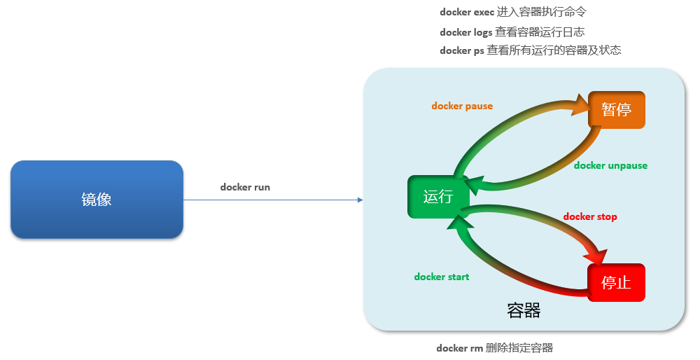
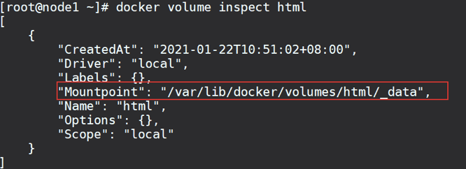
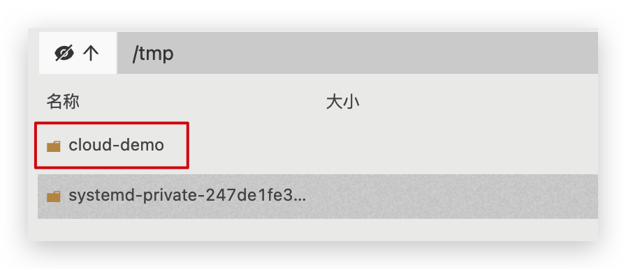

# 一、初识Docker

## 1、什么是Docker

微服务虽然具备各种各样的优势，但服务的拆分通用给部署带来了很大的麻烦。

- 分布式系统中，依赖的组件非常多，不同组件之间部署时往往会产生一些冲突。
- 在数百上千台服务中重复部署，环境不一定一致，会遇到各种问题

### 1.1、应用部署的环境问题

大型项目组件较多，运行环境也较为复杂，部署时会碰到一些问题：

- 依赖关系复杂，容易出现兼容性问题

- 开发、测试、生产环境有差异


例如一个项目中，部署时需要依赖于 node.js、Redis、RabbitMQ、MySQL 等，这些服务部署时所需要的函数库、依赖项各不相同，甚至会有冲突。给部署带来了极大的困难。

### 1.2、Docker 解决依赖兼容问题

而 Docker 就巧妙的解决了这些问题，Docker 是如何实现的呢？

Docker 为了解决依赖的兼容问题的，采用了两个手段：

- 将应用的 Libs（函数库）、Deps（依赖）、配置与应用一起打包

- 将每个应用放到一个隔离**容器**去运行，避免互相干扰


这样打包好的应用包中，既包含应用本身，也包括应用所需要的 Libs、Deps，无需在操作系统上安装这些，自然就不存在不同应用之间的兼容问题了。

虽然解决了不同应用的兼容问题，但是开发、测试等环境会存在差异，操作系统版本也会有差异，怎么解决这些问题呢？

### 1.3、Docker 解决操作系统环境差异

要解决不同操作系统环境差异问题，必须先了解操作系统结构。以一个Ubuntu操作系统为例，结构如下：


结构包括：

- 计算机硬件：例如 CPU、内存、磁盘等
- 系统内核：所有 Linux 发行版的内核都是 Linux，例如 CentOS、Ubuntu、Fedora 等。内核可以与计算机硬件交互，对外提供**内核指令**，用于操作计算机硬件。
- 系统应用：操作系统本身提供的应用、函数库。这些函数库是对内核指令的封装，使用更加方便。

应用与计算机交互的流程如下：

1）应用调用操作系统应用（函数库），实现各种功能

2）系统函数库是对内核指令集的封装，会调用内核指令

3）内核指令操作计算机硬件

Ubuntu 和 CentOS 都是基于 Linux 内核，无非是系统应用不同，提供的函数库有差异：


此时，如果将一个 Ubuntu 版本的 MySQL 应用安装到 CentOS 系统，MySQL 在调用 Ubuntu 函数库时，会发现找不到或者不匹配，就会报错了：


Docker 如何解决不同系统环境的问题？

- Docker 将用户程序与所需要调用的系统（比如 Ubuntu）函数库一起打包
- Docker 运行到不同操作系统时，直接基于打包的函数库，借助于操作系统的 Linux 内核来运行

如图：


### 1.4、小结

Docker 如何解决大型项目依赖关系复杂，不同组件依赖的兼容性问题？

- Docker 允许开发中将应用、依赖、函数库、配置一起**打包**，形成可移植镜像
- Docker 应用运行在容器中，使用沙箱机制，相互**隔离**

Docker 如何解决开发、测试、生产环境有差异的问题？

- Docker 镜像中包含完整运行环境，包括系统函数库，仅依赖系统的 Linux 内核，因此可以在任意 Linux 操作系统上运行

Docker 是一个快速交付应用、运行应用的技术，具备下列优势：

- 可以将程序及其依赖、运行环境一起打包为一个镜像，可以迁移到任意 Linux 操作系统
- 运行时利用沙箱机制形成隔离容器，各个应用互不干扰
- 启动、移除都可以通过一行命令完成，方便快捷

## 2、Docker 和虚拟机的区别

Docker 可以让一个应用在任何操作系统中非常方便的运行。而以前我们接触的虚拟机，也能在一个操作系统中，运行另外一个操作系统，保护系统中的任何应用。

两者有什么差异呢？

**虚拟机**（virtual machine）是在操作系统中**模拟**硬件设备，然后运行另一个操作系统，比如在 Windows 系统里面运行 Ubuntu 系统，这样就可以运行任意的 Ubuntu 应用了。

**Docker** 仅仅是封装函数库，并没有模拟完整的操作系统，如图：


对比来看：


小结：

Docker 和虚拟机的差异：

- docker 是一个系统进程；虚拟机是在操作系统中的操作系统

- docker 体积小、启动速度快、性能好；虚拟机体积大、启动速度慢、性能一般

## 3、Docker 架构

### 3.1、镜像和容器

Docker 中有几个重要的概念：

**镜像（Image）**：Docker 将应用程序及其所需的依赖、函数库、环境、配置等文件打包在一起，称为镜像。

**容器（Container）**：镜像中的应用程序运行后形成的进程就是**容器**，只是 Docker 会给容器进程做隔离，对外不可见。

一切应用最终都是代码组成，都是硬盘中的一个个的字节形成的**文件**。只有运行时，才会加载到内存，形成进程。

而**镜像**，就是把一个应用在硬盘上的文件、及其运行环境、部分系统函数库文件一起打包形成的文件包。这个文件包是只读的。

**容器**呢，就是将这些文件中编写的程序、函数加载到内存中运行，形成进程，只不过要隔离起来。因此一个镜像可以启动多次，形成多个容器进程。


例如你下载了一个 QQ，如果我们将 QQ 在磁盘上的运行**文件**及其运行的操作系统依赖打包，形成 QQ 镜像。然后你可以启动多次，双开、甚至三开 QQ，跟多个妹子聊天。

### 3.2、DockerHub

开源应用程序非常多，打包这些应用往往是重复的劳动。为了避免这些重复劳动，人们就会将自己打包的应用镜像，例如 Redis、MySQL 镜像放到网络上，共享使用，就像 GitHub 的代码共享一样。

- DockerHub：DockerHub 是一个官方的 Docker 镜像的托管平台。这样的平台称为 Docker Registry。

- 国内也有类似于 DockerHub 的公开服务，比如 [网易云镜像服务](https://c.163yun.com/hub)、[阿里云镜像库](https://cr.console.aliyun.com/)等。

我们一方面可以将自己的镜像共享到 DockerHub，另一方面也可以从 DockerHub 拉取镜像：


### 3.3、Docker架构

我们要使用 Docker 来操作镜像、容器，就必须要安装 Docker。

Docker 是一个 CS 架构的程序，由两部分组成：

- 服务端（server）：Docker 守护进程，负责处理 Docker 指令，管理镜像、容器等

- 客户端（client）：通过命令或 RestAPI 向 Docker 服务端发送指令。可以在本地或远程向服务端发送指令。

如图：


### 3.4、小结

镜像：

- 将应用程序及其依赖、环境、配置打包在一起

容器：

- 镜像运行起来就是容器，一个镜像可以运行多个容器

Docker 结构：

- 服务端：接收命令或远程请求，操作镜像或容器

- 客户端：发送命令或者请求到 Docker 服务端

DockerHub：

- 一个镜像托管的服务器，类似的还有阿里云镜像服务，统称为 DockerRegistry

## 4、安装Docker

企业部署一般都是采用 Linux 操作系统，而其中又数 CentOS 发行版占比最多，因此我们在 CentOS 下安装 Docker。

Docker 分为 CE 和 EE 两大版本。CE 即社区版（免费，支持周期 7 个月），EE 即企业版，强调安全，付费使用，支持周期 24 个月。

Docker CE 分为 `stable`、`test` 和 `nightly` 三个更新频道。

官方网站上有各种环境下的 [安装指南](https://docs.docker.com/install/)，这里主要介绍 Docker CE 在 CentOS 上的安装。

Docker CE 支持 64 位版本 CentOS 7，并且要求内核版本不低于 3.10，CentOS 7 满足最低内核的要求，所以我们在 CentOS 7 安装 Docker。

### 4.1、卸载（可选）

如果之前安装过旧版本的 Docker，可以使用下面命令卸载：

```sh
yum remove docker \
                  docker-client \
                  docker-client-latest \
                  docker-common \
                  docker-latest \
                  docker-latest-logrotate \
                  docker-logrotate \
                  docker-selinux \
                  docker-engine-selinux \
                  docker-engine \
                  docker-ce
```

### 4.2、安装docker

首先需要大家虚拟机联网，安装 yum 工具

```sh
yum install -y yum-utils \
           device-mapper-persistent-data \
           lvm2 --skip-broken
```

然后更新本地镜像源：

```shell
# 设置docker镜像源
yum-config-manager \
    --add-repo \
    https://mirrors.aliyun.com/docker-ce/linux/centos/docker-ce.repo
    
sed -i 's/download.docker.com/mirrors.aliyun.com\/docker-ce/g' /etc/yum.repos.d/docker-ce.repo

yum makecache fast
```

然后输入命令：

```shell
yum install -y docker-ce
```

docker-ce 为社区免费版本。稍等片刻，docker 即可安装成功。

### 4.3、启动docker

Docker 应用需要用到各种端口，逐一去修改防火墙设置非常麻烦，因此建议大家直接关闭防火墙！

启动docker前，一定要关闭防火墙！！

```sh
# 关闭
systemctl stop firewalld

# 禁止开机启动防火墙
systemctl disable firewalld
```

然后通过命令启动 docker：

```sh
systemctl start docker  # 启动docker服务

systemctl stop docker  # 停止docker服务

systemctl restart docker  # 重启docker服务
```

然后输入命令，可以查看 docker 版本：

```sh
docker -v
```

如图：

 

### 4.4、配置镜像加速

docker 官方镜像仓库网速较差，我们需要设置国内镜像服务：

参考阿里云的镜像加速文档：[https://cr.console.aliyun.com/cn-hangzhou/instances/mirrors](https://cr.console.aliyun.com/cn-hangzhou/instances/mirrors)

```sh
sudo mkdir -p /etc/docker
sudo tee /etc/docker/daemon.json <<-'EOF'
{
  "registry-mirrors": ["https://xfxfjdub.mirror.aliyuncs.com"]
}
EOF
sudo systemctl daemon-reload
sudo systemctl restart docker
```

# 二、Docker的基本操作

## 1、镜像操作

### 1.1、镜像名称

首先来看下镜像的名称组成：

- 镜名称一般分两部分组成：`[repository]:[tag]`
- 在没有指定 tag 时，默认是 latest，代表最新版本的镜像

如图：


这里的 mysql 就是 repository，5.7 就是 tag，合一起就是镜像名称，代表 5.7 版本的 MySQL 镜像。

### 1.2、镜像命令

常见的镜像操作命令如图：


### 1.3、拉取、查看镜像

需求：从 DockerHub 中拉取一个 nginx 镜像并查看

1）首先去镜像仓库搜索 nginx 镜像，比如 [DockerHub](https://hub.docker.com/)：


2）根据查看到的镜像名称，拉取自己需要的镜像，通过命令：`docker pull nginx`


3）通过命令 `docker images` 查看拉取到的镜像：


### 1.4、保存、导入镜像

需求：利用 `docker save` 将 nginx 镜像导出磁盘，然后再通过 load 加载回来

1）利用 `docker xx --help` 命令查看 `docker save` 和 `docker load` 的语法

例如，查看 save 命令用法，可以输入命令：

```sh
docker save --help
```

结果：


命令格式：

```shell
docker save -o [保存的目标文件名称] [镜像名称]
```


2）使用 `docker save` 导出镜像到磁盘 

运行命令：

```sh
docker save -o nginx.tar nginx:latest
```

结果如图：


3）使用 `docker load` 加载镜像

先删除本地的 nginx 镜像：

```sh
docker rmi nginx:latest
```

然后运行命令，加载本地文件：

```sh
docker load -i nginx.tar
```

结果：


### 1.5、练习

需求：去 DockerHub 搜索并拉取一个 Redis 镜像

目标：

1）去 DockerHub 搜索 Redis 镜像

2）查看 Redis 镜像的名称和版本

3）利用 `docker pull` 命令拉取镜像

4）利用 `docker save` 命令将 redis:latest 打包为一个 redis.tar 包

5）利用 `docker rmi` 删除本地的 redis:latest

6）利用 `docker load` 重新加载 redis.tar 文件

## 2、容器操作

### 2.1、容器相关命令

容器操作的命令如图：



容器保护三个状态：

- 运行：进程正常运行
- 暂停：进程暂停，CPU 不再运行，但并不释放内存
- 停止：进程终止，回收进程占用的内存、CPU 等资源

其中：

- `docker run`：创建并运行一个容器，处于运行状态
- `docker pause`：让一个运行的容器暂停
- `docker unpause`：让一个容器从暂停状态恢复运行
- `docker stop`：停止一个运行的容器
- `docker start`：让一个停止的容器再次运行

- `docker rm`：删除一个容器

### 2.2、创建并运行一个容器

去 docker hub 查看创建并运行 nginx 容器的命令：

```sh
docker run --name containerName -p 80:80 -d nginx
```

命令解读：

- docker run：创建并运行一个容器
- --name：给容器起一个名字，比如叫做 mn
- -p：将宿主机端口与容器端口映射，冒号左侧是宿主机端口，右侧是容器端口
- -d：后台运行容器
- nginx：镜像名称，例如 nginx

这里的 `-p` 参数，是将容器端口映射到宿主机端口。

默认情况下，容器是隔离环境，我们直接访问宿主机的 80 端口，肯定访问不到容器中的 nginx。

现在，将容器的 80 与宿主机的 80 关联起来，当我们访问宿主机的 80 端口时，就会被映射到容器的 80，这样就能访问到 nginx 了：


> 1. `docker run` 命令的常见参数有哪些？
>    * --name：指定容器名称
>    * -p：指定端口映射
>    * -d：让容器后台运行
>
> 2. 查看容器日志的命令：
>    * `docker logs`
>    * 添加 -f 参数可以持续查看日志
>
> 3. 查看容器状态：
>    * `docker ps`

### 2.3、进入容器，修改文件

**需求**：进入 Nginx 容器，修改 HTML 文件内容，添加 “传智教育欢迎您”

**提示**：进入容器要用到 `docker exec` 命令。

**步骤**：

1）进入容器。进入我们刚刚创建的 nginx 容器的命令为：

```sh
docker exec -it mn bash
```

命令解读：

- docker exec ：进入容器内部，执行一个命令

- -it : 给当前进入的容器创建一个标准输入、输出终端，允许我们与容器交互

- mn ：要进入的容器的名称

- bash：进入容器后执行的命令，bash 是一个 Linux 终端交互命令


2）进入 nginx 的 HTML 所在目录 /usr/share/nginx/html

容器内部会模拟一个独立的 Linux 文件系统，看起来如同一个 Linux 服务器一样：


nginx 的环境、配置、运行文件全部都在这个文件系统中，包括我们要修改的 html 文件。

查看 DockerHub 网站中的 nginx 页面，可以知道 nginx 的 html 目录位置在 `/usr/share/nginx/html`

我们执行命令，进入该目录：

```sh
cd /usr/share/nginx/html
```

 查看目录下文件：


3）修改 index.html 的内容

容器内没有 vi 命令，无法直接修改，我们用下面的命令来修改：

```sh
sed -i -e 's#Welcome to nginx#传智教育欢迎您#g' -e 's#<head>#<head><meta charset="utf-8">#g' index.html
```

在浏览器访问自己的虚拟机地址，例如 http://192.168.150.101，即可看到结果：


### 2.4、小结

`docker run` 命令的常见参数有哪些？

- --name：指定容器名称
- -p：指定端口映射
- -d：让容器后台运行

查看容器日志的命令：

- `docker logs`
- 添加 -f 参数可以持续查看日志

查看容器状态：

- `docker ps`
- `docker ps -a` 查看所有容器，包括已经停止的

删除容器：

* `docker rm`

* 不能删除运行中的容器，除非添加 -f 参数

进入容器：

* 命令是 `docker exec -it [容器名] [要执行的命令]`

* exec 命令可以进入容器修改文件，但是在容器内修改文件是不推荐的

## 3、数据卷（容器数据管理）

在之前的 nginx 案例中，修改 nginx 的 html 页面时，需要进入 nginx 内部。并且因为没有编辑器，修改文件也很麻烦。

这就是因为容器与数据（容器内文件）耦合带来的后果。


要解决这个问题，必须将数据与容器解耦，这就要用到数据卷了。

### 3.1、什么是数据卷

**数据卷（volume）**是一个虚拟目录，指向宿主机文件系统中的某个目录。


一旦完成数据卷挂载，对容器的一切操作都会作用在数据卷对应的宿主机目录了。

这样，我们操作宿主机的 /var/lib/docker/volumes/html 目录，就等于操作容器内的 /usr/share/nginx/html 目录了

### 3.2、数据集操作命令

数据卷操作的基本语法如下：

```sh
docker volume [COMMAND]
```

`docker volume` 命令是数据卷操作，根据命令后跟随的 command 来确定下一步的操作：

- create：创建一个 volume
- inspect：显示一个或多个 volume 的信息
- ls：列出所有的 volume
- prune：删除未使用的 volume
- rm：删除一个或多个指定的 volume

### 3.3、创建和查看数据卷

**需求**：创建一个数据卷，并查看数据卷在宿主机的目录位置

① 创建数据卷

```sh
docker volume create html
```

② 查看所有数据

```sh
docker volume ls
```

结果：


③ 查看数据卷详细信息卷

```sh
docker volume inspect html
```

结果：



可以看到，我们创建的 html 这个数据卷关联的宿主机目录为 `/var/lib/docker/volumes/html/_data` 目录

**小结**：

数据卷的作用：

- 将容器与数据分离，解耦合，方便操作容器内数据，保证数据安全

数据卷操作：

- `docker volume create`：创建数据卷
- `docker volume ls`：查看所有数据卷
- `docker volume inspect`：查看数据卷详细信息，包括关联的宿主机目录位置
- `docker volume rm`：删除指定数据卷
- `docker volume prune`：删除所有未使用的数据卷

### 3.4、挂载数据卷

我们在创建容器时，可以通过 -v 参数来挂载一个数据卷到某个容器内目录，命令格式如下：

```sh
docker run \
  --name mn \
  -v html:/root/html \
  -p 8080:80
  nginx \
```

这里的 -v 就是挂载数据卷的命令：

- `-v html:/root/htm`：把 html 数据卷挂载到容器内的 /root/html 这个目录中

### 3.5、案例-给nginx挂载数据卷

**需求**：创建一个 nginx 容器，修改容器内的 html 目录内的 index.html 内容

**分析**：上个案例中，我们进入 nginx 容器内部，已经知道 nginx 的 html 目录所在位置 /usr/share/nginx/html，我们需要把这个目录挂载到 html 这个数据卷上，方便操作其中的内容。

**提示**：运行容器时使用 -v 参数挂载数据卷

步骤：

① 创建容器并挂载数据卷到容器内的 HTML 目录

```sh
docker run --name mn -v html:/usr/share/nginx/html -p 80:80 -d nginx
```

② 进入 html 数据卷所在位置，并修改 HTML 内容

```sh
# 查看html数据卷的位置
docker volume inspect html

# 进入该目录
cd /var/lib/docker/volumes/html/_data

# 修改文件
vi index.html
```

> 数据卷挂载方式：
>
> * -v volumeName: /targetContainerPath
>
> * 如果容器运行时 volume 不存在，会自动被创建出来

### 3.6、案例-给MySQL挂载本地目录

容器不仅仅可以挂载数据卷，也可以直接挂载到宿主机目录上。关联关系如下：

- 带数据卷模式：宿主机目录 --> 数据卷 ---> 容器内目录
- 直接挂载模式：宿主机目录 ---> 容器内目录

如图：


**语法**：

目录挂载与数据卷挂载的语法是类似的：

- `-v [宿主机目录]:[容器内目录]`
- `-v [宿主机文件]:[容器内文件]`


**需求**：创建并运行一个 MySQL 容器，将宿主机目录直接挂载到容器

实现思路如下：

1）将课前资料中的 mysql.tar 文件上传到虚拟机，通过 load 命令加载为镜像

2）创建目录 /tmp/mysql/data

3）创建目录 /tmp/mysql/conf，将课前资料提供的 hmy.cnf 文件上传到 /tmp/mysql/conf

4）去 DockerHub 查阅资料，创建并运行 MySQL 容器，要求：

① 挂载 /tmp/mysql/data 到 mysql 容器内数据存储目录

② 挂载 /tmp/mysql/conf/hmy.cnf 到 mysql 容器的配置文件

③ 设置 MySQL 密码

### 3.7、小结

`docker run` 的命令中通过 -v 参数挂载文件或目录到容器中：

- -v volume 名称:容器内目录
- -v 宿主机文件:容器内文件
- -v 宿主机目录:容器内目录

数据卷挂载与目录直接挂载的区别

- 数据卷挂载耦合度低，由 docker 来管理目录，但是目录较深，不好找
- 目录挂载耦合度高，需要我们自己管理目录，不过目录容易寻找查看

# 三、Dockerfile自定义镜像

常见的镜像在 DockerHub 就能找到，但是我们自己写的项目就必须自己构建镜像了。

而要自定义镜像，就必须先了解镜像的结构才行。

## 1、镜像结构

镜像是将应用程序及其需要的系统函数库、环境、配置、依赖打包而成。

我们以 MySQL 为例，来看看镜像的组成结构：


> 镜像是分层结构，每一层称为一个 Layer
>
> * BaseImage 层：包含基本的系统函数库、环境变量、文件系统
> * Entrypoint：入口，是镜像中应用启动的命令
> * 其它：在 BaseImage 基础上添加依赖、安装程序、完成整个应用的安装和配置

简单来说，镜像就是在系统函数库、运行环境基础上，添加应用程序文件、配置文件、依赖文件等组合，然后编写好启动脚本打包在一起形成的文件。

我们要构建镜像，其实就是实现上述打包的过程。

## 2、Dockerfile语法

构建自定义的镜像时，并不需要一个个文件去拷贝，打包。

我们只需要告诉 Docker，我们的镜像的组成，需要哪些 BaseImage、需要拷贝什么文件、需要安装什么依赖、启动脚本是什么，将来 Docker 会帮助我们构建镜像。

而描述上述信息的文件就是 Dockerfile 文件。

**Dockerfile** 就是一个文本文件，其中包含一个个的**指令(Instruction)**，用指令来说明要执行什么操作来构建镜像。每一个指令都会形成一层 Layer。


更多详细语法说明，请参考官网文档： [https://docs.docker.com/engine/reference/builder](https://docs.docker.com/engine/reference/builder)

## 3、构建Java项目

### 3.1、基于 Ubuntu 构建 Java 项目

需求：基于 Ubuntu 镜像构建一个新镜像，运行一个 Java 项目

- 步骤 1：新建一个空文件夹 docker-demo

- 步骤2：拷贝课前资料中的 docker-demo.jar 文件到 docker-demo 这个目录

- 步骤3：拷贝课前资料中的 jdk8.tar.gz 文件到 docker-demo 这个目录

- 步骤4：拷贝课前资料提供的 Dockerfile 到 docker-demo 这个目录


其中的内容如下：

```dockerfile
# 指定基础镜像
FROM ubuntu:16.04
# 配置环境变量，JDK的安装目录
ENV JAVA_DIR=/usr/local

# 拷贝jdk和java项目的包
COPY ./jdk8.tar.gz $JAVA_DIR/
COPY ./docker-demo.jar /tmp/app.jar

# 安装JDK
RUN cd $JAVA_DIR \
 && tar -xf ./jdk8.tar.gz \
 && mv ./jdk1.8.0_144 ./java8

# 配置环境变量
ENV JAVA_HOME=$JAVA_DIR/java8
ENV PATH=$PATH:$JAVA_HOME/bin

# 暴露端口
EXPOSE 8090
# 入口，java项目的启动命令
ENTRYPOINT java -jar /tmp/app.jar
```

- 步骤5：进入 docker-demo

  将准备好的 docker-demo 上传到虚拟机任意目录，然后进入 docker-demo 目录下

- 步骤6：运行命令：

  ```sh
  docker build -t javaweb:1.0 .
  ```

  其中 . 代表 Dockfile 文件存放的位置

最后访问 http://192.168.150.101:8090/hello/count，其中的 IP 改成自己的虚拟机 IP

### 3.2、基于 java8 构建 Java 项目

虽然我们可以基于 Ubuntu 基础镜像，添加任意自己需要的安装包，构建镜像，但是却比较麻烦。所以大多数情况下，我们都可以在一些安装了部分软件的基础镜像上做改造。

例如，构建 Java 项目的镜像，可以在已经准备了 JDK 的基础镜像基础上构建。

需求：基于 java:8-alpine 镜像，将一个 Java 项目构建为镜像

实现思路如下：

1. 新建一个空的目录，然后在目录中新建一个文件，命名为 Dockerfile
2. 拷贝课前资料提供的 docker-demo.jar 到这个目录中
3. 编写 Dockerfile 文件：
   1. 基于 java:8-alpine 作为基础镜像
   2. 将 app.jar 拷贝到镜像中
   3. 暴露端口
   4. 编写入口 ENTRYPOINT，内容如下：

```dockerfile
# 指定基础镜像
FROM java:8-alpine

COPY ./docker-demo.jar /tmp/app.jar

# 暴露端口
EXPOSE 8090
# 入口，java项目的启动命令
ENTRYPOINT java -jar /tmp/app.jar
```

4. 使用 docker build 命令构建镜像

   ```sh
   docker build -t javaweb:2.0 .
   ```

5. 使用 docker run 创建容器并运行

## 4、小结

小结：

> 1. Dockerfile 的本质是一个文件，通过指令描述镜像的构建过程
>
> 2. Dockerfile 的第一行必须是 FROM，从一个基础镜像来构建
>
> 3. 基础镜像可以是基本操作系统，如 Ubuntu。也可以是其他人制作好的镜像，例如：java:8-alpine
>

# 四、Docker-Compose

Docker Compose 可以基于 Compose 文件帮我们快速的部署分布式应用，而无需手动一个个创建和运行容器！


## 1、初识 DockerCompose

Compose 文件是一个文本文件，通过指令定义集群中的每个容器如何运行。格式如下：

```json
version: "3.8"

services:
  mysql:
    image: mysql:5.7.25
    environment:
     MYSQL_ROOT_PASSWORD: 123 
    volumes:
     - "/tmp/mysql/data:/var/lib/mysql"
     - "/tmp/mysql/conf/hmy.cnf:/etc/mysql/conf.d/hmy.cnf"
  web:
    build: .
    ports:
     - "8090:8090"
```

上面的 Compose文件就描述一个项目，其中包含两个容器：

- mysql：一个基于 `mysql:5.7.25` 镜像构建的容器，并且挂载了两个目录
- web：一个基于 `docker build` 临时构建的镜像容器，映射端口是 8090

DockerCompose 的详细语法参考官网：[https://docs.docker.com/compose/compose-file/](https://docs.docker.com/compose/compose-file/)

其实 DockerCompose 文件可以看做是将多个 docker run 命令写到一个文件，只是语法稍有差异。

## 2、安装DockerCompose

### 2.1、下载

Linux 下需要通过命令下载：

```sh
# 安装
curl -L https://github.com/docker/compose/releases/download/1.23.1/docker-compose-`uname -s`-`uname -m` > /usr/local/bin/docker-compose
```

### 2.2、修改文件权限

修改文件权限：

```sh
# 修改权限
chmod +x /usr/local/bin/docker-compose
```

### 2.3、Base 自动补全命令

```sh
# 补全命令
curl -L https://raw.githubusercontent.com/docker/compose/1.29.1/contrib/completion/bash/docker-compose > /etc/bash_completion.d/docker-compose
```

如果这里出现错误，需要修改自己的 hosts 文件：

```sh
echo "199.232.68.133 raw.githubusercontent.com" >> /etc/hosts
```

## 3、部署微服务集群

**需求**：将之前学习的 cloud-demo 微服务集群利用 DockerCompose 部署

**实现思路**：

① 查看课前资料提供的 cloud-demo 文件夹，里面已经编写好了 docker-compose 文件

② 修改自己的 cloud-demo 项目，将配置文件中数据库、nacos 地址都命名为 docker-compose 中的服务名

③ 使用 maven 打包工具，将项目中的每个微服务都打包为 app.jar

④ 将打包好的 app.jar 拷贝到 cloud-demo 中的每一个对应的子目录中

⑤ 将 cloud-demo 上传至虚拟机，利用 `docker-compose up -d` 来部署

### 3.1、compose文件

查看课前资料提供的 cloud-demo 文件夹，里面已经编写好了 docker-compose 文件，而且每个微服务都准备了一个独立的目录：


内容如下：

```yaml
version: "3.2"

services:
  nacos:
    image: nacos/nacos-server
    environment:
      MODE: standalone
    ports:
      - "8848:8848"
      
  mysql:
    image: mysql:5.7.25
    environment:
      MYSQL_ROOT_PASSWORD: 123
    volumes:
      - "$PWD/mysql/data:/var/lib/mysql"
      - "$PWD/mysql/conf:/etc/mysql/conf.d/"
      
  userservice:
    build: ./user-service
    
  orderservice:
    build: ./order-service
    
  gateway:
    build: ./gateway
    ports:
      - "10010:10010"
```

可以看到，其中包含 5 个 service 服务：

- `nacos`：作为注册中心和配置中心
  - `image: nacos/nacos-server`： 基于 nacos/nacos-server 镜像构建
  - `environment`：环境变量
    - `MODE: standalone`：单点模式启动
  - `ports`：端口映射，这里暴露了 8848 端口
- `mysql`：数据库
  - `image: mysql:5.7.25`：镜像版本是 mysql:5.7.25
  - `environment`：环境变量
    - `MYSQL_ROOT_PASSWORD: 123`：设置数据库 root 账户的密码为 123
  - `volumes`：数据卷挂载，这里挂载了 mysql 的 data、conf 目录，其中有提前准备好的数据
- `userservice`、`orderservice`、`gateway`：都是基于 Dockerfile 临时构建的

查看 mysql 目录，可以看到其中已经准备好了 cloud_order、cloud_user 表：


查看微服务目录，可以看到都包含 Dockerfile 文件：


内容如下：

```dockerfile
FROM java:8-alpine
COPY ./app.jar /tmp/app.jar
ENTRYPOINT java -jar /tmp/app.jar
```

### 3.2、修改微服务配置

因为微服务将来要部署为 docker 容器，而容器之间互联不是通过 IP 地址，而是通过容器名。这里我们将 order-service、user-service、gateway 服务的 mysql、nacos 地址都修改为基于容器名的访问。

如下所示：

```yaml
spring:
  datasource:
    url: jdbc:mysql://mysql:3306/cloud_order?useSSL=false
    username: root
    password: 123
    driver-class-name: com.mysql.jdbc.Driver
  application:
    name: orderservice
  cloud:
    nacos:
      server-addr: nacos:8848 # nacos服务地址
```

### 3.3、打包

接下来需要将我们的每个微服务都打包。因为之前查看到 Dockerfile 中的 jar 包名称都是 app.jar，因此我们的每个微服务都需要用这个名称。

可以通过修改 pom.xml 中的打包名称来实现，每个微服务都需要修改：

```xml
<build>
  <!-- 服务打包的最终名称 -->
  <finalName>app</finalName>
  <plugins>
    <plugin>
      <groupId>org.springframework.boot</groupId>
      <artifactId>spring-boot-maven-plugin</artifactId>
    </plugin>
  </plugins>
</build>
```

打包后：


### 3.4、拷贝 jar 包到部署目录

编译打包好的 app.jar 文件，需要放到 Dockerfile 的同级目录中。注意：每个微服务的 app.jar 放到与服务名称对应的目录，别搞错了。

user-service：


order-service：


gateway：


### 3.5、部署

最后，我们需要将文件整个 cloud-demo 文件夹上传到虚拟机中，并由 DockerCompose 部署。

上传到任意目录：



部署：

进入 cloud-demo 目录，然后运行下面的命令：

```sh
docker-compose up -d
```

# 五、Docker镜像仓库

镜像仓库（ Docker Registry ）有公共的和私有的两种形式：

* 公共仓库：例如 Docker 官方的 [Docker Hub](https://hub.docker.com/)，国内也有一些云服务商提供类似于 Docker Hub 的公开服务，比如 [网易云镜像服务](https://c.163.com/hub)、[DaoCloud镜像服务](https://hub.daocloud.io/)、[阿里云镜像服务](https://cr.console.aliyun.com/)等。

* 除了使用公开仓库外，用户还可以在本地搭建私有 Docker Registry。企业自己的镜像最好是采用私有 Docker Registry 来实现。

## 1、搭建私有镜像仓库

搭建镜像仓库可以基于 Docker 官方提供的 DockerRegistry 来实现。

官网地址：[https://hub.docker.com/_/registry](https://hub.docker.com/_/registry)

### 1.1、简化版镜像仓库

Docker 官方的 Docker Registry 是一个基础版本的 Docker 镜像仓库，具备仓库管理的完整功能，但是没有图形化界面。

搭建方式比较简单，命令如下：

```sh
docker run -d \
    --restart=always \
    --name registry	\
    -p 5000:5000 \
    -v registry-data:/var/lib/registry \
    registry
```

命令中挂载了一个数据卷 registry-data 到容器内的 /var/lib/registry 目录，这是私有镜像库存放数据的目录。

访问 http://YourIp:5000/v2/_catalog 可以查看当前私有镜像服务中包含的镜像

### 1.2、带有图形化界面版本

使用 DockerCompose 部署带有图形化界面的 DockerRegistry，命令如下：

```yaml
version: '3.0'
services:
  registry:
    image: registry
    volumes:
      - ./registry-data:/var/lib/registry
      
  ui:
    image: joxit/docker-registry-ui:static
    ports:
      - 8080:80
    environment:
      - REGISTRY_TITLE=传智教育私有仓库
      - REGISTRY_URL=http://registry:5000
    depends_on:
      - registry
```

### 1.3、配置 Docker 信任地址

我们的私服采用的是 HTTP 协议，默认不被 Docker 信任，所以需要做一个配置：

```sh
# 打开要修改的文件
vi /etc/docker/daemon.json

# 添加内容：
"insecure-registries":["http://192.168.150.101:8080"]

# 重加载
systemctl daemon-reload

# 重启docker
systemctl restart docker
```

## 2、推送、拉取镜像

推送镜像到私有镜像服务必须先 tag，步骤如下：

① 重新 tag 本地镜像，名称前缀为私有仓库的地址：192.168.150.101:8080/

 ```sh
docker tag nginx:latest 192.168.150.101:8080/nginx:1.0 
 ```

② 推送镜像

```sh
docker push 192.168.150.101:8080/nginx:1.0 
```

③ 拉取镜像

```sh
docker pull 192.168.150.101:8080/nginx:1.0 
```

## 3、小结

1. 推送本地镜像到仓库前都必须重命名 (docker tag) 镜像，以镜像仓库地址为前缀

2. 镜像仓库推送前需要把仓库地址配置到 docker 服务的 daemon.json 文件中，被 docker 信任

3. 推送使用 docker push 命令

4. 拉取使用 docker pull 命令
